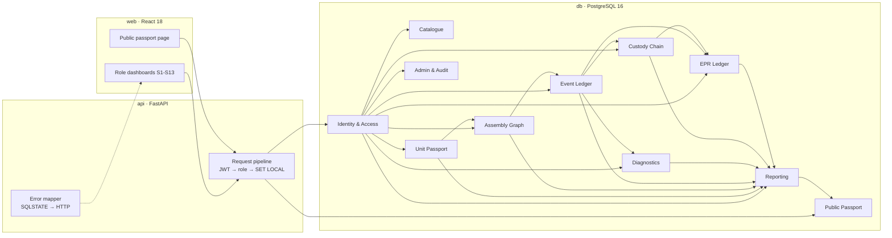

# ReCircuit

A component-level digital product passport for e-waste. Every physical part (device, board, battery, storage,
memory, display, chip) is a *unit* with a QR passport. PostgreSQL 16 records which unit was inside which and when,
keeps an append-only, SHA-256 hash-chained event ledger, tracks custody between organisations, and ties each
recycled unit to at most one EPR certificate. FastAPI is a thin, role-aware transport; React is the interface.

> **The database is the final authority.** The ten business rules (C1–C10) are PostgreSQL constraints and
> triggers, so no application bug, and no direct SQL session, can produce a passport that lies.

## Quick start

Prerequisite: Docker with Compose. From a fresh clone:

```bash
cp .env.example .env
docker compose up          # or: make demo
```

That builds everything, applies the migrations, loads the small demo world and starts the stack:

| What | Where |
| --- | --- |
| Web portal | <http://localhost:5173> |
| API | <http://localhost:8000/api/v1/health> |
| Public passport (no sign-in) | `http://localhost:5173/p/<passport id>` |

Demo logins (all fictional; the password for every account is `recircuit-demo`):

| Role | Email | Lands on |
| --- | --- | --- |
| Administrator | `admin@example.com` | `/admin` |
| Auditor | `auditor@example.com` | `/auditor` |
| Producer | `producer01@example.com` | `/producer` |
| Collector | `collector01@example.com` | `/collector` |
| Technician | `refurbisher01@example.com` | `/technician` |
| Recycler | `recycler01@example.com` | `/recycler` |

Start over with `docker compose down -v` (this deletes the database volume). If port 5432 is taken on your machine,
set `DB_HOST_PORT` in `.env`.

## Architecture



- `db/` owns the schema and the rules (dbmate migrations, pgTAP tests, the walkthrough fixture).
- `api/` owns transport, authentication and error mapping. Every write is one call to a stored routine inside one
  transaction, under a PostgreSQL role matching the caller (`SET LOCAL ROLE`), so a role the database does not allow
  is refused even if the API were wrong.
- `web/` owns presentation. `seed/` builds synthetic worlds through the same routines the API uses.
- Nothing "current" is stored: state, holder and parent are derived from history by views.

## Seeding

```bash
make venv                                          # Python 3.12 environment in api/.venv
api/.venv/bin/python -m seed --profile small --seed 42                 # ≈ 500 units, ≈ 3,800 events
api/.venv/bin/python -m seed --profile large --seed 42 --jobs 4        # 50,000 units, ≈ 520,000 events
```

Deterministic: the same profile and seed give the same rows (and, with `--jobs 1`, the same event hashes). The seed
refuses a database that already holds data. It also plants a few custody gaps and missing-unit discrepancies so the
auditor screens have something to find.

## Tests

| Suite | Command | What it proves |
| --- | --- | --- |
| Database (pgTAP) | `make db-test` | Rules C1–C10, hash chain and tamper detection, the TRD walkthrough, roles and row-level security (174 tests) |
| API | `cd api && pytest` | Pipeline, errors, auth, every router, the 20-way certificate race (needs Docker and dbmate) |
| Types and lint | `cd api && ruff check . && mypy --strict app tests` · `cd web && npm run build && npm run lint` | |
| Browser flows F1–F5 | `make e2e` | Collect/dismantle/test, reinstall, receive/recycle/certify, tamper check, public passport. **Deletes the local database volume.** |
| Load (k6) | `k6 run loadtest/passport.js` | Passport p95 and part-tree p95 on the large profile |
| Concurrency | `api/.venv/bin/python loadtest/race.py` | Two technicians, one part; 20 certificate requests, one winner |
| Accessibility | `cd e2e && npm run lighthouse -- <passport id>` | Lighthouse accessibility of the auditor console and the public passport |

Measured results are in [`docs/plans/SUMMARY.md`](docs/plans/SUMMARY.md).

## The rules

| Rule | Mechanism |
| --- | --- |
| C1 one parent at a time | `EXCLUDE USING gist` on `assembly_link` |
| C2 no assembly cycles | `trg_asm_no_cycle` |
| C3 events and audit log are append-only | `trg_event_immutable`, `trg_audit_immutable` and revoked privileges |
| C4 hash chain | `trg_event_20_chain`, `sp_verify_chain` |
| C5 legal transitions, ordered in time | `trg_event_10_transition`, `event_transition` |
| C6 harvesting closes the assembly period | `trg_event_harvest` |
| C7 tests only on a diagnosis | `trg_test_event_type` |
| C8 one open manifest per unit | `trg_transfer_one_open` |
| C9 only units recycled by the issuer back a certificate | `trg_cert_unit_recycled` |
| C10 one certificate per unit, no over-claim | primary key on `certificate_unit.unit_id`, deferred `trg_cert_quantity` |

## Documentation

- [`docs/ReCircuit_PRD.md`](docs/ReCircuit_PRD.md) – requirements. [`docs/ReCircuit_Technical_Deep_Dive.md`](docs/ReCircuit_Technical_Deep_Dive.md) – the technical design.
- [`docs/ReCircuit_Build_Instructions.md`](docs/ReCircuit_Build_Instructions.md) – the task-by-task build playbook and its errata.
- [`docs/PROGRESS.md`](docs/PROGRESS.md) – task checklist with what was found and decided along the way. [`docs/stack.lock.md`](docs/stack.lock.md) – pinned versions.

## Known limits

Login lockout, refresh sessions and the public-passport cache and rate limit are kept in process memory, so the API is
single-instance. The CPCB EPR logic is modelled for learning, not as legal advice. All demo data is synthetic.
