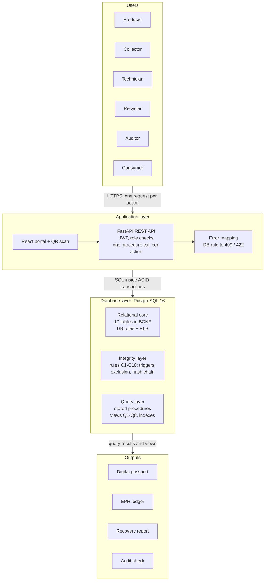
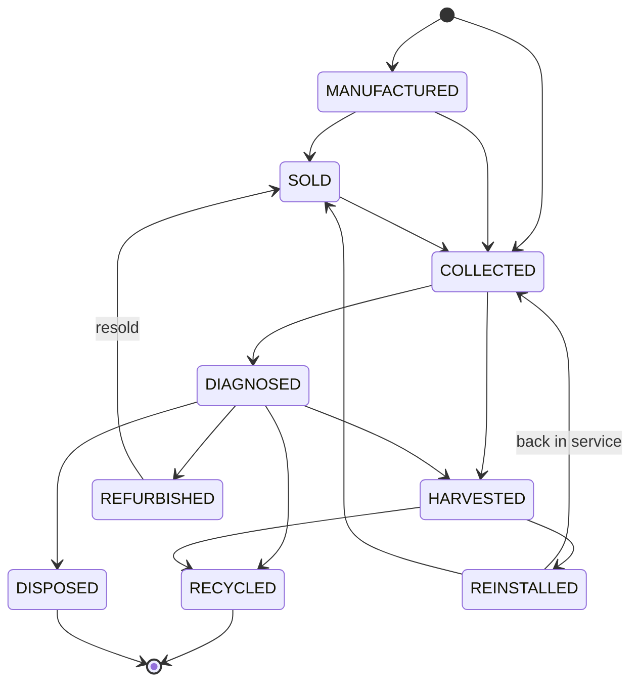
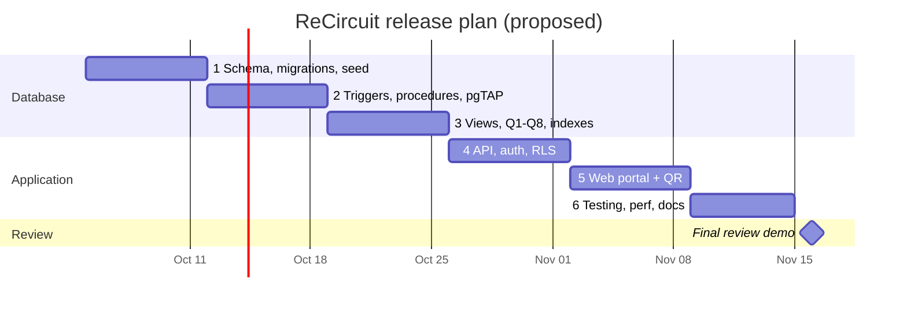

# ReCircuit

**Product Requirements Document · v1.0 — Component-Level Digital Product Passport for E-Waste**

*V Rohith Pranov · 24BCE0619 · B.Tech CSE, VIT Vellore · BCSE302P Database Systems Lab (Slot D2: L11 + L12)*

`RECIRCUIT-PRD · v1.0 · 05-Oct-2026 · Draft for faculty review`

---

## Document Control

### Revision history

| Version | Date | Author | Change |
| --- | --- | --- | --- |
| 0.1 | 29-Sep-2026 | V Rohith Pranov | Proposal and database design (Assessment 6) |
| 1.0 | 05-Oct-2026 | V Rohith Pranov | Full PRD: requirements, user stories, NFRs, plan, risks, KPIs |

### Reviewers & approval

| Name | Role | Status |
| --- | --- | --- |
| Course faculty, BCSE302P | Evaluator | Pending |
| V Rohith Pranov | Author / developer | Approved |

### How to read this document

Read §1 for the one-page summary and §2 for why the product is needed. §7 (user stories) and §9 (functional requirements) are the backbone: every requirement has an ID (FR-x.y, NFR-x) that the database objects, API endpoints and tests trace back to. §11–§12 describe the architecture and data at PRD level; the full schema, DDL and normalization proof are in the Assessment 6 design document. Priorities: P0 = demo-critical, P1 = fast-follow within this release, P2 = vision.

## Contents

- [1. Executive Summary](#1-executive-summary)
- [2. Background & Problem Statement](#2-background--problem-statement)
- [3. Competitive Landscape](#3-competitive-landscape)
- [4. Vision & Product Strategy](#4-vision--product-strategy)
- [5. Goals & Success Criteria](#5-goals--success-criteria)
- [6. Target Users & Personas](#6-target-users--personas)
- [7. User Stories & Acceptance Criteria](#7-user-stories--acceptance-criteria)
- [8. Scope](#8-scope)
- [9. Functional Requirements](#9-functional-requirements)
- [10. Non-Functional Requirements](#10-non-functional-requirements)
- [11. System Architecture & Tech Stack](#11-system-architecture--tech-stack)
- [12. Data & Integration Requirements](#12-data--integration-requirements)
- [13. UX & Interface Requirements](#13-ux--interface-requirements)
- [14. Assumptions, Constraints & Dependencies](#14-assumptions-constraints--dependencies)
- [15. Risks & Mitigations](#15-risks--mitigations)
- [16. Success Metrics & KPIs](#16-success-metrics--kpis)
- [17. Release Plan & Timeline](#17-release-plan--timeline)
- [18. Team — Roles & Responsibilities](#18-team--roles--responsibilities)
- [19. Future Roadmap](#19-future-roadmap)
- [20. Appendix — Glossary & References](#20-appendix--glossary--references)

## 1. Executive Summary

### 1.1 What ReCircuit is

ReCircuit is a component-level digital product passport for electronic waste. It gives every physical electronic part — a phone, its logic board, the battery inside it, a chip harvested from that board — a permanent identity in one PostgreSQL system of record, and follows it through collection, diagnosis, harvesting, reuse and recycling.

The release defined here has five capabilities:

1. Unit passports — one row and one QR identifier per physical object.
2. Temporal assembly tree — which unit sat inside which parent, and when.
3. Tamper-evident lifecycle log — append-only, SHA-256 hash-chained events with diagnostic results.
4. Chain of custody — manifests for every hand-over between organisations.
5. EPR ledger — each recycled unit backs at most one Extended Producer Responsibility certificate.

### 1.2 The core insight

> **Core insight.** Reuse fraud and recycling fraud are the same failure: a physical item's history is detached from its records. If the unit — not the device, not the shipment, not the kilogram — is the primary key of the whole system, and the database itself refuses histories that cannot be true (a part in two devices at once, a unit counted in two certificates, an event edited after the fact), then trust comes from the schema rather than from the people entering data.

### 1.3 Why it wins

- Integrity by construction: ten business rules are enforced by PostgreSQL constraints and triggers, so no application bug or direct SQL session can break them.
- Time is first-class: the assembly tree can be queried as it was on any past date, which no flat device register can do.
- One record serves every party: the same passport answers the technician (is this part healthy?), the recycler (can I certify this?), the producer (am I compliant?) and the consumer (is this genuine?).
- Built on open, standard tools — no blockchain or paid cloud service is needed to get tamper evidence.

## 2. Background & Problem Statement

### 2.1 The shift / why now

E-waste regulation is moving from "how much was collected" to "which items were recovered". India's E-Waste (Management) Rules, 2022 run on EPR: producers meet recycling targets by acquiring certificates generated by registered recyclers. At the same time the circular economy is moving from whole devices to components — a dead laptop may still hold a healthy SSD, RAM and battery pack — and the EU's digital product passport initiative points the same way. Both trends need item-level records that do not exist today.

### 2.2 The evidence

| Finding | Figure | Source |
| --- | --- | --- |
| E-waste generated worldwide in 2022 | 62 billion kg (7.8 kg per person) | ITU/UNITAR Global E-waste Monitor 2024 |
| Share documented as formally collected and recycled | 22.3% | Global E-waste Monitor 2024 |
| Projected e-waste in 2030 | 82 billion kg; documented recycling falling to ~20% | Global E-waste Monitor 2024 |
| Recoverable resources unaccounted for in 2022 | USD 62 billion | UNITAR press release, 2024 |
| Falsely certified e-waste in one intercepted Spanish network | 750,000 kg | UNITAR press release, 2024 |

### 2.3 Problem statement

> **Problem.** Collectors, refurbishers, recyclers and producers have no shared system of record that follows an individual electronic component across its life. Part histories are lost when components move between devices, nested and changing device structure cannot be queried over time, recycled mass is not linked to the certificates that claim it, and spreadsheet records can be edited after an audit. As a result, parts reuse cannot be trusted and recycling claims cannot be verified.

| # | Problem | Who feels it | Consequence today |
| --- | --- | --- | --- |
| P1 | Part history is lost when a component moves between devices | Refurbishers, buyers | Tested parts and counterfeits look the same |
| P2 | Device structure is nested and changes over time | Repair shops, dismantlers | "What was inside this laptop on 1 March?" cannot be answered |
| P3 | Recycled mass is not linked to the certificate that claims it | Producers, regulators | Kilograms claimed twice or never recycled |
| P4 | Records live in spreadsheets and paper manifests | Auditors | History can be edited after the fact |
| P5 | Custody between organisations is undocumented | Collectors, recyclers | Units appear at a recycler with no shipment proving their origin |

## 3. Competitive Landscape

Existing approaches each cover part of the problem; none combines unit-level reuse tracking with certificate backing in a queryable, constraint-enforced database.

| Approach | What it does | Gap ReCircuit fills |
| --- | --- | --- |
| CPCB EPR portal | Registers producers and recyclers; records EPR certificate generation and transfer | Works in kilograms per category, not per physical unit; no link from a certificate to the items behind it |
| Spreadsheets and paper manifests (status quo) | Collectors and recyclers log lots and weights | Editable, unshared, no assembly structure, no integrity rules |
| Battery / materials traceability platforms (e.g. Circulor) | Trace raw materials and battery supply chains, often for EV batteries | Focus on upstream supply chain and single product classes; not open, not focused on component harvest and reuse |
| Blockchain-based e-waste trackers | Immutable shared ledger of transfers | Heavy infrastructure; weak at relational queries such as part trees over time and certificate backing |
| ERP / warehouse systems (e.g. SAP) | Inventory and serial-number tracking inside one company | Stop at the company boundary; no cross-organisation custody or EPR logic |

## 4. Vision & Product Strategy

### 4.1 Vision

Every electronic component carries a passport that anyone can trust, so that reuse is the default and every recycling claim is provable down to the item.

### 4.2 Strategy — wedge → platform

| Stage | Focus | Outcome |
| --- | --- | --- |
| Wedge (this release) | The database: unit passports, assembly over time, hash-chained events, custody, EPR backing | A system of record whose rules cannot be broken, demonstrated on phones and laptops |
| Expand | Reuse inventory and public passports for refurbished parts | Refurbishers and buyers start relying on passports to price and trust parts |
| Platform | Regulator integration, external anchoring of hash heads, EU passport export | A neutral registry that producers, recyclers and regulators all read from |

### 4.3 Guiding principles

- The database is the final authority — if a rule can be declared, it is enforced in PostgreSQL.
- History is never edited — corrections are new events.
- Derive, don't store — current state and current holder are computed from history, never kept in a column.
- Least privilege — each role sees and writes only what it needs; the public sees no personal data.
- Explainable refusals — when the database rejects a write, the user is told which rule and why.

## 5. Goals & Success Criteria

### 5.1 Product goals

| ID | Goal | Measured by |
| --- | --- | --- |
| G1 | Trustworthy part history — one passport shows model, materials, assembly history, events, tests and custody | FR-4.4 passes against the underlying tables |
| G2 | Integrity by construction — no double installation, no double certification, no history edits | 0 of 10 rules violated in the negative test suite |
| G3 | Auditable compliance — EPR position and certificate backing checkable by query | Certificate backing report flags every seeded over-claim |
| G4 | Demonstrable DBMS depth — normalization, constraints, triggers, transactions, recursive and window queries, views, indexes, access control | Evaluation criteria in §16 met |

### 5.2 Definition of done (Release 1.0 — final lab review)

- All P0 user stories pass their acceptance criteria in automated tests.
- All ten integrity rules (C1–C10, §12.1) are refused by the database when the API is bypassed.
- Hash-chain verification passes on clean data and detects a deliberately edited row.
- Passport lookup p95 < 200 ms on the large seed profile (50,000 units, 500,000 events).
- Flows: collect → dismantle → test → harvest → reinstall, and ship → recycle → certify → audit, run live in the demo.
- A fresh clone starts with one command (docker compose up) and the test suite is green in CI.

## 6. Target Users & Personas

| Role | Persona | Goals | Pain today |
| --- | --- | --- | --- |
| Producer | Meera, compliance lead at a phone brand | Register models; acquire certificates; know compliance position | Cannot verify that certificates are backed by real recycling |
| Collector / dismantler | Arjun, collection-centre supervisor | Fast intake; dismantle into sub-units; ship lots | Paper intake logs; no record once a device is broken down |
| Technician | Kavya, refurbishment technician | Test, harvest and reinstall parts with evidence | Harvested parts arrive with no history or test data |
| Recycler | Suresh, recycler plant manager | Receive manifests; record recycling; issue certificates | Lots arrive with missing units; certificate claims are hard to justify |
| Auditor | Dr. Rao, third-party auditor | Verify records without trusting the people who entered them | Spreadsheets can be edited; custody gaps are invisible |
| Consumer | Buyer of a refurbished device | Check a part is genuine and healthy | No way to verify a refurbished part |
| Admin | System administrator | Manage organisations, users, roles, backups | — |

## 7. User Stories & Acceptance Criteria

Priority tags: P0 = demo-critical, P1 = fast-follow within this release, P2 = vision.

#### US-1 · P0

As a collector, I want to scan a device's QR code and log it as collected, so that its custody starts the moment I take it.

- Acceptance: Scanning an existing passport opens the unit; an unknown code offers "register unit".
- Acceptance: A COLLECTED event is written with facility, actor and time, and is hash-chained (FR-6.4).
- Acceptance: Intake completes in under 30 seconds on a phone.

#### US-2 · P0

As a collector, I want to dismantle a device into its board, battery and storage in one action, so that each part gets its own passport.

- Acceptance: Child units, assembly links and events are created in one transaction (FR-5.8).
- Acceptance: If any child fails validation, nothing is written.

#### US-3 · P0

As a technician, I want to record a battery health test with a score, so that reuse decisions rest on stored evidence.

- Acceptance: Tests can be attached only to a DIAGNOSED event (FR-7.1).
- Acceptance: Scores outside 0–100 are refused.

#### US-4 · P0

As a technician, I want to reinstall a harvested part into another device, so that the part's history follows it.

- Acceptance: A new assembly link opens and a REINSTALLED event is written.
- Acceptance: If the part is still linked to another device, the request fails with "still inside device …" (rule C1).

#### US-5 · P0

As a technician, I want to list harvested batteries with health ≥ 80, so that I can pick parts for refurbishment.

- Acceptance: Only units whose latest event is HARVESTED and latest score ≥ threshold are listed (FR-7.3).
- Acceptance: Results return in under 1 second on the large seed profile.

#### US-6 · P0

As a collector, I want to create a shipment manifest to a recycler, so that custody is documented for both sides.

- Acceptance: Manifest has a unique number, total mass and at least one unit.
- Acceptance: A unit already on an unreceived manifest is refused (rule C8).

#### US-7 · P1

As a recycler, I want to confirm receipt and flag missing or extra units, so that discrepancies are visible before processing.

- Acceptance: Only the receiving organisation can confirm; received time ≥ shipped time.
- Acceptance: Discrepancies appear on both organisations' dashboards.

#### US-8 · P0

As a recycler, I want to issue an EPR certificate backed by recycled units, so that the claim is provable and cannot be reused.

- Acceptance: Only units recycled at my facility can back it (rule C9).
- Acceptance: A unit already used in a certificate is refused; claimed kg > backed kg fails at COMMIT (rule C10).

#### US-9 · P1

As a producer, I want to see certificates and kg acquired against my target, so that I know my compliance position.

- Acceptance: Compliance view shows kg acquired vs target per category per financial year.

#### US-10 · P0

As an auditor, I want to run a tamper check on one unit or the whole dataset, so that edited history is detected.

- Acceptance: Clean data verifies 100%; one edited event is reported with the first broken link.

#### US-11 · P1

As an auditor, I want to list units received with no matching manifest, so that custody gaps are caught.

- Acceptance: Every seeded gap is listed and there are no false positives.

#### US-12 · P0

As a consumer, I want to open a public passport page from a QR code, so that I can trust a refurbished part.

- Acceptance: No login required; shows model, age, event dates, latest health and a chain-verified badge.
- Acceptance: No staff names, emails or manifests are shown (FR-11.2).

#### US-13 · P0

As any staff user, I want to see what was inside a device on a past date, so that repair and warranty disputes can be settled.

- Acceptance: Part tree for any date matches hand-computed answers in 10 scripted scenarios (FR-5.6).

## 8. Scope

### 8.1 In scope (Release 1.0 — lab deliverable)

- Organisations, facilities and staff with six roles plus public read-only access.
- Part-model catalogue with category, mass, JSONB specification and material composition.
- Unit passports with UUID passport ID and QR code.
- Time-bounded assembly hierarchy: install, dismantle, harvest, reinstall.
- Append-only, hash-chained lifecycle events and diagnostic tests.
- Custody manifests with receipt and discrepancy reporting.
- EPR certificate issuance, backing and producer allocation.
- Reports Q1–Q8, REST API, role-based web portal, public passport page, seed generator, automated tests.

### 8.2 Out of scope

- Live integration with the CPCB EPR portal or GST systems.
- Payments, pricing and a refurbished-parts marketplace.
- QR/RFID printing, scanner hardware, IoT weighing scales, GPS tracking.
- Machine-learning prediction of part life.
- Native mobile apps (the portal is responsive) and multi-tenant hosting.

## 9. Functional Requirements

Requirements are grouped by component and individually ID'd. Priority uses P0/P1/P2 as in §7.

### 9.1 Authentication & Access Control (FR-1)

| ID | Requirement | Priority | Acceptance criteria |
| --- | --- | --- | --- |
| FR-1.1 | Staff log in with email and password | P0 | Wrong credentials return 401; 5 failures in 15 min lock the account for 15 min |
| FR-1.2 | API issues a 15-minute JWT access token and a rotating refresh token | P0 | Refresh token is httpOnly and single-use |
| FR-1.3 | Each staff account has one role and belongs to one facility | P0 | Role limited by CHECK to PRODUCER, COLLECTOR, TECHNICIAN, RECYCLER_OPERATOR, AUDITOR, ADMIN |
| FR-1.4 | Each API session runs under a matching PostgreSQL role | P0 | A technician cannot insert into epr_certificate even via raw SQL |
| FR-1.5 | Users see only their organisation's data, except auditors | P0 | Row-level security; cross-organisation reads return 0 rows |
| FR-1.6 | Passwords stored as bcrypt hashes | P0 | No plaintext or reversible password anywhere |
| FR-1.7 | Password reset by single-use emailed link | P2 | Link expires after 30 minutes |

### 9.2 Organisations & Staff (FR-2)

| ID | Requirement | Priority | Acceptance criteria |
| --- | --- | --- | --- |
| FR-2.1 | Register an organisation with type, CPCB number and GSTIN | P0 | Duplicates refused (UNIQUE); GSTIN 15 characters |
| FR-2.2 | Organisations own facilities with valid 6-digit pincodes | P0 | Invalid pincode fails CHECK |
| FR-2.3 | Admin creates staff tied to a facility | P0 | Email unique; organisation derived from facility, never stored on the user |
| FR-2.4 | Deactivate staff without deleting history | P1 | Deactivated users cannot log in; past events keep their name |
| FR-2.5 | Facility records authorised annual capacity | P2 | Warning at 90% of capacity |

### 9.3 Part-Model Catalogue (FR-3)

| ID | Requirement | Priority | Acceptance criteria |
| --- | --- | --- | --- |
| FR-3.1 | Producer registers a model: number, category, mass | P0 | (manufacturer, model number) unique; mass > 0 |
| FR-3.2 | Model carries a category-specific JSONB specification | P1 | Queryable with ->> and a GIN index |
| FR-3.3 | Model lists mass of each tracked material | P0 | One row per (model, material); mass > 0 |
| FR-3.4 | Materials flagged critical and/or hazardous | P1 | Recovery report can filter by flag |
| FR-3.5 | Catalogue search by manufacturer, category, model | P1 | < 300 ms for 5,000 models |

### 9.4 Unit Passports (FR-4)

| ID | Requirement | Priority | Acceptance criteria |
| --- | --- | --- | --- |
| FR-4.1 | Create a unit with model, serial and manufacture date | P0 | (model, serial) unique; UUID passport ID generated by the database |
| FR-4.2 | Each unit has a QR code for its public passport URL | P0 | QR resolves to /p/{passport_uid} |
| FR-4.3 | Look up a unit by QR, passport ID or (model, serial) | P0 | All three return the same unit; unknown returns 404 |
| FR-4.4 | Passport view: model, materials, state, holder, parent, children, events, tests, custody | P0 | View v_unit_passport matches base tables in tests |
| FR-4.5 | Current state and holder are derived, never stored | P0 | No status column on unit; derived by v_unit_current |
| FR-4.6 | Bulk-create units from CSV | P1 | All-or-nothing transaction; failing rows reported |

### 9.5 Assembly Hierarchy (FR-5)

| ID | Requirement | Priority | Acceptance criteria |
| --- | --- | --- | --- |
| FR-5.1 | Install a child unit into a parent at a timestamp | P0 | Creates assembly_link with removed_at NULL |
| FR-5.2 | A unit is inside at most one parent at any instant | P0 | Overlap fails EXCLUDE USING gist (rule C1) |
| FR-5.3 | No unit inside itself or its own descendant | P0 | CHECK + trg_asm_no_cycle (rule C2) |
| FR-5.4 | Harvesting closes the open link at event time | P0 | trg_event_harvest sets removed_at (rule C6) |
| FR-5.5 | Show a device's full part tree now | P0 | Recursive CTE, all depths |
| FR-5.6 | Show the part tree on any past date | P0 | Correct in all 10 scripted scenarios |
| FR-5.7 | Show every device a part has been inside | P1 | Ordered by install time with durations |
| FR-5.8 | Dismantle a device into new sub-units in one action | P0 | sp_dismantle is atomic |

### 9.6 Lifecycle Events (FR-6)

| ID | Requirement | Priority | Acceptance criteria |
| --- | --- | --- | --- |
| FR-6.1 | Record one of 9 event types with facility and actor | P0 | Other types fail CHECK |
| FR-6.2 | Store valid time and transaction time | P0 | occurred_at ≤ recorded_at; recorded_at defaults to now() |
| FR-6.3 | Events are append-only | P0 | UPDATE/DELETE fail for every role (rule C3) |
| FR-6.4 | Each event is hash-chained to the unit's previous event | P0 | SHA-256 over prev_hash ‖ unit ‖ type ‖ occurred_at ‖ facility ‖ actor (rule C4) |
| FR-6.5 | Only legal state transitions accepted | P0 | Per the transition table in §11.3 (rule C5); 422 otherwise |
| FR-6.6 | Corrections reference the event they correct | P1 | corrects_event_id; original unchanged |
| FR-6.7 | Per-unit timeline | P0 | Ordered by occurred_at with facility, actor and tests |

### 9.7 Diagnostics (FR-7)

| ID | Requirement | Priority | Acceptance criteria |
| --- | --- | --- | --- |
| FR-7.1 | Attach test results only to DIAGNOSED events | P0 | Other event types refused (rule C7) |
| FR-7.2 | Test has type, PASS/DEGRADED/FAIL result, value and 0–100 score | P0 | Out-of-range score fails CHECK |
| FR-7.3 | Reuse inventory filtered by category and minimum health | P0 | Only latest-HARVESTED units with latest score ≥ threshold |
| FR-7.4 | Health trend chart per part | P2 | Score over time on the passport page |

### 9.8 Chain of Custody (FR-8)

| ID | Requirement | Priority | Acceptance criteria |
| --- | --- | --- | --- |
| FR-8.1 | Create a manifest between two organisations with its units | P0 | Unique number; sender ≠ receiver; ≥ 1 unit |
| FR-8.2 | Record dispatch mass and each unit's declared condition | P0 | Mass > 0; WORKING / FAULTY / SCRAP |
| FR-8.3 | Receiver confirms receipt | P0 | received_at ≥ shipped_at; receiver only |
| FR-8.4 | Flag missing or extra units at receipt | P1 | Stored in transfer_discrepancy; visible to both sides |
| FR-8.5 | One open manifest per unit | P0 | trg_transfer_one_open (rule C8) |
| FR-8.6 | Current holder = receiver of latest received manifest | P0 | Derived by v_unit_current |
| FR-8.7 | Custody-gap report | P1 | Anti-join lists every seeded gap, no false positives |

### 9.9 EPR Certificates (FR-9)

| ID | Requirement | Priority | Acceptance criteria |
| --- | --- | --- | --- |
| FR-9.1 | Recycler issues a certificate: number, category, kg, financial year | P0 | Unique number; FY format YYYY-YY; kg > 0 |
| FR-9.2 | Certificate backed by specific recycled units | P0 | Only units recycled at the issuer (rule C9) |
| FR-9.3 | Each unit backs at most one certificate, ever | P0 | PK on certificate_unit.unit_id (rule C10) |
| FR-9.4 | Claimed kg cannot exceed backed kg | P0 | Deferred trigger fails COMMIT (rule C10) |
| FR-9.5 | Recycler allocates a certificate to one producer | P0 | Allocated once; issuer only |
| FR-9.6 | Producer compliance vs target | P1 | v_epr_compliance per category per FY |
| FR-9.7 | Certificate backing report | P0 | Claimed vs backed kg; shortfalls flagged |

### 9.10 Reports & Analytics (FR-10)

| ID | Report | Priority | Technique |
| --- | --- | --- | --- |
| FR-10.1 | Q1 Unit passport | P0 | Multi-table JOIN, view |
| FR-10.2 | Q2 Part tree on a date | P0 | Recursive CTE with range containment |
| FR-10.3 | Q3 Current state and holder | P0 | Window function (latest row per unit) |
| FR-10.4 | Q4 Reuse inventory | P0 | JOIN + filter + aggregate |
| FR-10.5 | Q5 Material recovered per recycler per quarter | P1 | Aggregate; materialized view refreshed nightly |
| FR-10.6 | Q6 Certificate backing | P0 | GROUP BY + HAVING |
| FR-10.7 | Q7 Custody gaps | P1 | NOT EXISTS anti-join |
| FR-10.8 | Q8 Tamper check | P0 | Window LAG + recomputed hash |
| FR-10.9 | CSV export of any report | P1 | Same rows as on screen |

### 9.11 Public Passport (FR-11)

| ID | Requirement | Priority | Acceptance criteria |
| --- | --- | --- | --- |
| FR-11.1 | Anyone can open /p/{passport_uid} without logging in | P0 | Model, age, event dates, latest health, chain-verified badge |
| FR-11.2 | Public page hides personal and internal data | P0 | Served only from v_public_passport via role public_reader |
| FR-11.3 | Passport IDs cannot be enumerated | P0 | Random UUIDv4; unit_id never exposed publicly |

### 9.12 Administration & Audit (FR-12)

| ID | Requirement | Priority | Acceptance criteria |
| --- | --- | --- | --- |
| FR-12.1 | Admin dashboard: units by state, open manifests, certificates this FY | P1 | Counts match base tables |
| FR-12.2 | Insert-only log of sensitive actions | P1 | audit_log records actor and time |
| FR-12.3 | Seed generator for demo and load tests | P0 | small (~500 units) and large (50,000 units) profiles; deterministic |
| FR-12.4 | Nightly logical backup | P2 | Restores into an empty DB and passes tests |

## 10. Non-Functional Requirements

| ID | Category | Requirement | Target |
| --- | --- | --- | --- |
| NFR-1 | Integrity | Every declarable rule enforced in PostgreSQL | All 10 rules refused with the API bypassed |
| NFR-2 | Atomicity | Multi-step operations in one transaction | No partial rows if the API dies mid-operation |
| NFR-3 | Concurrency | Two technicians installing the same part at once | Exactly one commit, one constraint error |
| NFR-4 | Isolation | Certificate issue at SERIALIZABLE; others READ COMMITTED | No over-claim under 20 concurrent attempts |
| NFR-5 | Auditability | Valid time + transaction time; events never changed | Tamper check passes clean, fails on any edit |
| NFR-6 | Performance | Passport p95 < 200 ms; part tree p95 < 300 ms; reports < 2 s | Measured at 50,000 units / 500,000 events |
| NFR-7 | Indexing | FK, passport, (unit, time), GiST, GIN indexes | EXPLAIN shows index scans for Q1–Q4 |
| NFR-8 | Security | bcrypt, JWT, least-privilege roles, RLS, parameterised SQL | OWASP Top-10 checklist reviewed |
| NFR-9 | Privacy | Public pages expose no personal data | public_reader reads v_public_passport only |
| NFR-10 | Recoverability | Base backup + WAL point-in-time recovery | Restore drill run once |
| NFR-11 | Usability | Core flows ≤ 3 screens; works at 360 px width | Collector intake < 30 s |
| NFR-12 | Maintainability | Numbered SQL migrations; one-command setup | docker compose up on a fresh clone |
| NFR-13 | Portability | PostgreSQL 16 with only pgcrypto and btree_gist | No paid cloud services |
| NFR-14 | Accessibility | WCAG 2.1 AA contrast and keyboard navigation | Lighthouse accessibility ≥ 90 |

## 11. System Architecture & Tech Stack

### 11.1 Architecture

ReCircuit is a three-tier application in which the database, not the API, is the final authority on every business rule. Every write goes from a role dashboard to one API endpoint, which calls one stored procedure inside one transaction; the integrity layer either accepts the whole change or refuses it with a named constraint that the API turns into a readable message.



*Figure 1. ReCircuit architecture — users → application → database → outputs*

| Layer | Responsibility | Does not |
| --- | --- | --- |
| Presentation (React) | Role dashboards, QR scanning, forms, charts, public passport | Hold business rules or call the database directly |
| Application (FastAPI) | Auth, role and organisation checks, validation, calling procedures, mapping DB errors to HTTP | Build SQL by string concatenation; cache or reorder writes |
| Database (PostgreSQL 16) | Storage, rules C1–C10, hash chain, transactions, views, RLS, indexes | Render UI or send notifications |

### 11.2 Reference flow — reinstall a harvested battery

```
POST /api/v1/units/48213/reinstall
{ "new_parent_unit_id": 51007, "occurred_at": "2026-10-20T11:42:00+05:30", "facility_id": 12 }

201 Created   { "event_type": "REINSTALLED", "event_hash": "9f1c…2ab7" }
409 Conflict  { "error": { "code": "ASM_OVERLAP", "constraint": "assembly_link_excl",
                 "message": "Unit 48213 is already installed in unit 50991 at that time" } }
```

### 11.3 Unit lifecycle

A unit's state is the type of its latest event; trigger C5 accepts a new event only if the transition is allowed. Diagnosis is the decision point.



*Figure 2. Unit lifecycle — 9 event types, 2 terminal*

| Latest event (state) | Allowed next events |
| --- | --- |
| (no events yet) | MANUFACTURED, COLLECTED |
| MANUFACTURED | SOLD, COLLECTED |
| SOLD | COLLECTED |
| COLLECTED | DIAGNOSED, HARVESTED, RECYCLED, DISPOSED |
| DIAGNOSED | DIAGNOSED, REFURBISHED, HARVESTED, RECYCLED, DISPOSED |
| HARVESTED | DIAGNOSED, REINSTALLED, RECYCLED, DISPOSED |
| REFURBISHED | SOLD, DIAGNOSED |
| REINSTALLED | SOLD, COLLECTED, DIAGNOSED |
| RECYCLED / DISPOSED | — (terminal) |

### 11.4 Tech stack

| Layer | Choice | Why |
| --- | --- | --- |
| Database | PostgreSQL 16 + pgcrypto, btree_gist | Exclusion constraints, range types, recursive CTEs, JSONB, RLS |
| Migrations | Numbered .sql files via dbmate | Every DB object is reviewable SQL |
| Backend | Python 3.12, FastAPI, psycopg 3 | Thin layer over stored procedures; DB errors map to API errors |
| Auth | pyjwt, passlib (bcrypt) | Stateless sessions, standard hashing |
| Frontend | React 18 + TypeScript, Vite, Tailwind, TanStack Query | Fast role dashboards; responsive |
| QR | qrcode (server), html5-qrcode (browser) | Generate and scan without hardware |
| Testing | pgTAP, pytest + testcontainers, Playwright, k6 | Rules tested against a real database |
| DevOps | Docker Compose, GitHub Actions | One-command setup; CI on every push |

## 12. Data & Integration Requirements

### 12.1 Core data collections

Seventeen relations, all in BCNF. Relations 1–14 are unchanged from the Assessment 6 design; 15–17 and three columns are added by this PRD.

| # | Relation | Purpose | Primary key |
| --- | --- | --- | --- |
| 1 | organization | Producers, collectors, dismantlers, refurbishers, recyclers | org_id |
| 2 | facility | Sites owned by an organisation | facility_id |
| 3 | actor | Staff accounts (+ password_hash, is_active) | actor_id |
| 4 | part_model | Catalogue designs with JSONB spec | model_id |
| 5 | material | Tracked materials | material_id |
| 6 | model_material | Material mass per model | (model_id, material_id) |
| 7 | unit | Physical objects with passports | unit_id |
| 8 | assembly_link | Child-in-parent periods | (child_unit_id, installed_at) |
| 9 | lifecycle_event | Hash-chained events (+ corrects_event_id) | event_id |
| 10 | diagnostic_test | Test results | test_id |
| 11 | custody_transfer | Shipment manifests | transfer_id |
| 12 | transfer_item | Units on a manifest | (transfer_id, unit_id) |
| 13 | epr_certificate | Recycler-issued certificates | cert_id |
| 14 | certificate_unit | Units backing a certificate | unit_id |
| 15 | transfer_discrepancy (new) | Missing / extra units at receipt | (transfer_id, unit_id) |
| 16 | epr_target (new) | Producer target kg per category per FY | (producer_id, category, financial_year) |
| 17 | audit_log (new) | Insert-only sensitive-action log | log_id |

Integrity rules enforced by the database:

| # | Rule | Mechanism |
| --- | --- | --- |
| C1 | One parent at a time | EXCLUDE USING gist on assembly_link |
| C2 | No assembly cycles | trg_asm_no_cycle (recursive ancestor walk) |
| C3 | Events append-only | trg_event_immutable + REVOKE UPDATE, DELETE |
| C4 | Hash chain | trg_event_chain using pgcrypto digest() |
| C5 | Legal transitions only | trg_event_transition + event_transition table |
| C6 | Harvest closes link | trg_event_harvest |
| C7 | Tests only on DIAGNOSED | trg_test_event_type |
| C8 | One open manifest per unit | trg_transfer_one_open |
| C9 | Only units recycled at the issuer back a certificate | trg_cert_unit_recycled |
| C10 | One certificate per unit; no over-claim | PK on certificate_unit.unit_id; deferred trg_cert_quantity |

Views: v_unit_current, v_unit_passport, v_public_passport, v_reuse_inventory, v_certificate_backing, v_epr_compliance, mv_material_recovery. Stored procedures: sp_dismantle, sp_harvest, sp_reinstall, sp_issue_certificate, sp_verify_chain. Database roles: rc_producer, rc_collector, rc_technician, rc_recycler, rc_auditor, rc_admin, public_reader — no role has UPDATE or DELETE on lifecycle_event or audit_log.

### 12.2 External integrations

| Integration | Release 1.0 | Notes |
| --- | --- | --- |
| CPCB EPR portal | Not integrated | Certificates modelled locally; export format planned (§19) |
| Browser camera (QR scan) | Integrated | html5-qrcode; typing the passport ID is the fallback |
| Email (password reset) | P2 | SMTP via environment configuration |
| CSV import / export | Integrated | Bulk unit intake (FR-4.6) and report export (FR-10.9) |

## 13. UX & Interface Requirements

| # | Screen | Roles | Main elements |
| --- | --- | --- | --- |
| S1 | Login | All staff | Email, password, lockout message |
| S2 | Collector dashboard | Collector | Scan to collect, today's intake, open manifests, Dismantle |
| S3 | Technician workbench | Technician | Scan part, record test, harvest / reinstall, reuse inventory |
| S4 | Recycler dashboard | Recycler | Incoming manifests, receive + discrepancies, recycle queue, issue certificate |
| S5 | Producer dashboard | Producer | Catalogue, certificates held, compliance vs target |
| S6 | Auditor console | Auditor | Tamper check, certificate backing, custody gaps, audit log |
| S7 | Unit passport (staff) | Staff | QR header; tabs Overview, Parts tree (date picker), Timeline, Tests, Custody, Certificates |
| S8 | Public passport | Anyone | Model, age, event dates, latest health, chain-verified badge |
| S9 | Manifest detail | Sender, receiver | Units, mass, status, discrepancies |
| S10 | Certificate wizard | Recycler | Details → pick recycled units (running kg) → confirm |
| S11 | Catalogue editor | Producer | Model form, JSON spec editor, materials table |
| S12 | Reports | Role-dependent | Q1–Q8 with filters and CSV export |
| S13 | Admin console | Admin | Organisations, facilities, users, roles |

- Database refusals are shown in plain words ("This battery is still inside device RC-50991"), never as raw SQL errors.
- The certificate wizard disables Issue until backed kg ≥ claimed kg.
- The parts-tree date picker defaults to now; changing it re-runs Q2 and greys out parts not inside on that date.
- Event types use fixed colours across screens, always paired with a text label.

## 14. Assumptions, Constraints & Dependencies

| Type | Item |
| --- | --- |
| Assumption | Every unit can carry a QR label; very small parts are tracked through their parent board until harvested |
| Assumption | First entries are made honestly; ReCircuit guarantees history cannot change afterwards, not that the first entry was true |
| Assumption | Recovered mass is weighed at the recycler, per unit or apportioned per lot |
| Assumption | Demo data is synthetic; no real company or person is represented |
| Constraint | Single developer; delivery by the lab's final review |
| Constraint | The database remains the source of truth; the API may not bypass constraints |
| Constraint | Open-source tools only; EPR logic is modelled for learning, not legal advice |
| Dependency | PostgreSQL 16 with pgcrypto and btree_gist (Docker image postgres:16) |
| Dependency | Python 3.12, Node.js 20, Docker; a browser with camera access for QR scan |

## 15. Risks & Mitigations

| ID | Risk | Likelihood | Impact | Mitigation |
| --- | --- | --- | --- | --- |
| R1 | Trigger logic grows complex and hides bugs | Medium | High | One pgTAP file per trigger; one rule per trigger; negative tests first |
| R2 | Recursive part-tree queries slow on deep trees | Medium | Medium | Depth cap 10; index on parent_unit_id; measure in Phase 3 |
| R3 | Hash chain breaks under concurrent inserts for one unit | Medium | High | Lock the unit's latest event (FOR UPDATE) in the trigger; concurrency test |
| R4 | SERIALIZABLE retries disrupt the demo | Low | Medium | API retries serialization failures up to 3 times |
| R5 | Row-level security blocks legitimate reads | Medium | Medium | Role-by-role read tests; auditor policy documented |
| R6 | UI work squeezes database work late in the schedule | High | High | Database and tests first (Phases 1–3); Should/Could screens can be dropped |
| R7 | Single developer; overlap with CAT/FAT exams | Medium | High | Two buffer days per phase; P0-only cut list ready |
| R8 | Extension unavailable on the lab machine | Low | High | Run PostgreSQL in Docker; verify btree_gist in Phase 1 |
| R9 | Scope creep (ML, marketplace) | Medium | Medium | Out-of-scope list (§8.2); changes only via PRD revision |

## 16. Success Metrics & KPIs

| ID | Metric | Definition | Target |
| --- | --- | --- | --- |
| KPI-1 | Rule violations accepted | Illegal writes accepted across the 13 negative tests | 0 |
| KPI-2 | Chain verification | Units whose hash chain verifies on clean seed data; tampered row detected | 100%; detected |
| KPI-3 | Passport latency | p95 of GET /units/{passport_uid} on the large seed | < 200 ms |
| KPI-4 | Part-tree correctness | Scripted BOM-at-date scenarios matching expected output | 10 / 10 |
| KPI-5 | Normal form | Base relations in BCNF | 17 / 17 |
| KPI-6 | Requirement coverage | P0 requirements with a passing linked test | 100% |
| KPI-7 | Demo completeness | End-to-end flows run live without manual SQL | 5 / 5 |

Proposed evaluation weighting (align with the course rubric):

| Criterion | Evidence | Weight |
| --- | --- | --- |
| Schema design and normalization | ER diagram, FD analysis, BCNF proof, DDL | 20% |
| Integrity and constraints | Rules C1–C10 and negative tests | 20% |
| Query depth | Q1–Q8: joins, recursive CTE, window functions, anti-join, aggregates, views | 15% |
| Transactions and concurrency | Procedures, isolation levels, concurrency tests | 10% |
| Physical design and performance | Indexes, EXPLAIN ANALYZE, latency results | 10% |
| Security and access control | DB roles, RLS, public view, auth tests | 10% |
| Working application and demo | Live flows | 10% |
| Documentation | PRD, design document, README, traceability matrix | 5% |

## 17. Release Plan & Timeline

Six one-week phases put all database work first, so the integrity rules are proven before any UI depends on them. Dates are proposed and should be moved to the lab's review schedule.



*Figure 3. Release plan — six weekly phases and the final review demo (proposed dates)*

| Phase | Dates | Deliverables | Exit criterion |
| --- | --- | --- | --- |
| 1 Schema, migrations, seed | Oct 5–11 | DDL for 17 tables, extensions, small seed | Empty DB builds and seed loads with zero errors |
| 2 Triggers, procedures, pgTAP | Oct 12–18 | Rules C1–C10, event_transition table, 5 procedures | All 13 negative tests pass |
| 3 Views, Q1–Q8, indexes | Oct 19–25 | Views, materialized view, indexes, large seed | Q1–Q8 match fixtures; NFR-6 met in EXPLAIN ANALYZE |
| 4 API, auth, RLS | Oct 26–Nov 1 | FastAPI endpoints, JWT, DB roles, RLS | Integration suite and role tests green |
| 5 Web portal + QR | Nov 2–8 | Screens S1–S13, QR generate/scan, public page | End-to-end flows pass in Playwright |
| 6 Testing, perf, docs | Nov 9–14 | Load and concurrency tests, README, traceability matrix, report | Definition of done (§5.2) complete |
| Final review demo | Nov 16 | Live demo | All KPIs in §16 met |

## 18. Team — Roles & Responsibilities

| Member | Role | Responsibilities |
| --- | --- | --- |
| V Rohith Pranov (24BCE0619) | Product owner, database engineer, full-stack developer | Requirements, schema and constraints, procedures and queries, API, portal, testing, documentation, demo |
| Course faculty, BCSE302P | Reviewer / evaluator | Approves scope, reviews milestones, grades against the rubric |

## 19. Future Roadmap

| Horizon | Capability |
| --- | --- |
| Next | CPCB EPR portal export/integration; RFID/NFC tags; IoT scales posting recovered mass |
| Next | External anchoring of daily hash-chain heads so even a database superuser cannot rewrite history unnoticed |
| Later | Battery remaining-useful-life prediction from stored diagnostic history |
| Later | Refurbished-parts marketplace listing verified passports |
| Later | EU Digital Product Passport export; offline-first mobile intake; multi-tenant regulator dashboards |

## 20. Appendix — Glossary & References

### 20.1 Glossary

| Term | Definition |
| --- | --- |
| BCNF | Boyce–Codd Normal Form: every determinant of a non-trivial FD is a candidate key |
| BOM | Bill of materials — the part tree of a device |
| CPCB | Central Pollution Control Board, India's regulator under the E-Waste Rules |
| CTE | Common table expression; WITH RECURSIVE walks the part tree |
| Digital product passport | A permanent record of one physical item's identity, composition and history |
| EPR | Extended Producer Responsibility — producers meet recycling targets through recycler certificates |
| Exclusion constraint | PostgreSQL constraint forbidding two rows whose values overlap under given operators |
| Hash chain | Each event stores a hash including the previous event's hash, so any edit breaks every later link |
| Harvesting | Removing a reusable part from a device |
| Manifest | A custody transfer record for one shipment |
| RLS | Row-level security — per-user row filtering in PostgreSQL |
| Valid / transaction time | When a fact happened vs when it was recorded |
| Unit | One physical object with its own passport: device, board, battery, storage, memory, display or chip |

### 20.2 References

[1] ITU & UNITAR, The Global E-waste Monitor 2024. https://www.itu.int/en/ITU-D/Environment/Pages/Publications/The-Global-E-waste-Monitor-2024.aspx

[2] UNITAR, Global E-waste Monitor 2024 press release. https://unitar.org/about/news-stories/press/global-e-waste-monitor-2024-electronic-waste-rising-five-times-faster-documented-e-waste-recycling

[3] Ministry of Environment, Forest and Climate Change, Government of India, E-Waste (Management) Rules, 2022.

[4] V Rohith Pranov, ReCircuit — Project Proposal & Database Design Document, BCSE302P Assessment 6, 29-Sep-2026.

[5] PostgreSQL 16 Documentation — exclusion constraints, range types, WITH RECURSIVE, row-level security.
