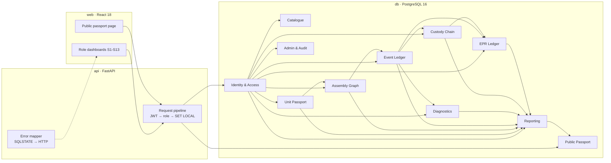

# ReCircuit

**Technical Deep-Dive (TRD) · v1.0 — Component-Level Digital Product Passport for E-Waste**

*V Rohith Pranov · 24BCE0619 · B.Tech CSE, VIT Vellore · BCSE302P Database Systems Lab (Slot D2: L11 + L12)*

`RECIRCUIT-TRD · v1.0 · 05-Oct-2026 · Draft for faculty review · Companion to RECIRCUIT-PRD v1.0`

---

> **Purpose.** This document defines *how* ReCircuit works, in enough depth to build it without guessing. It is the source of truth for the schema, triggers, procedures, views, roles and API contracts. The PRD (`ReCircuit_PRD.md`) says *what* and *why*; every requirement ID used here (FR-x.y, NFR-x) and every integrity-rule ID (C1–C10) refers to that document. If the PRD and this document ever disagree on a technical detail, this document wins and the PRD is corrected.

## Contents

1. The Unifying Thesis
2. System Topology
3. Identity & Access — who may do what, enforced below the API
4. Catalogue — what a part is made of
5. Unit Passport — one row per physical thing
6. Assembly Graph — what was inside what, and when
7. Event Ledger — history that cannot be rewritten
8. Diagnostics — evidence for reuse
9. Custody Chain — who held it, proven by manifests
10. EPR Ledger — one unit, one certificate, no over-claim
11. Reporting — eight questions the data must answer
12. Public Passport — trust without exposure
13. Admin & Audit — operating the system
14. End-to-End Walkthrough — A Day in the Life of Battery RC-48213
15. Build Priority — What Ships First
16. Appendix — Error Catalogue, Migration Order, Glossary

---

## 1. The Unifying Thesis

> **Thesis.** *Truth is a constraint, not a convention.* Every fact in ReCircuit is either **immutable history** (events, assembly periods, manifests, certificate backing) or **derived from history** (current state, current holder, part trees, compliance totals). Nothing "current" is ever stored, and every rule that makes a history impossible is enforced by PostgreSQL itself — so the API, the UI, and even a careless admin with a SQL prompt cannot produce a passport that lies.

This one idea decides every design choice below:

| Design choice | How it expresses the thesis |
| --- | --- |
| No `status` or `holder` column on `unit` | Current state is derived from the latest event (`v_unit_current`); it can never drift from history |
| `assembly_link` stores *periods*, not "current parent" | The past is queryable (`as_of` part trees) and overlap is a constraint violation (C1) |
| `lifecycle_event` is append-only and hash-chained | Rewriting history is refused (C3) and detectable even by a superuser (C4) |
| Business rules live in triggers and constraints, not in FastAPI | Bypassing the API bypasses nothing (NFR-1) |
| Multi-step operations are stored procedures | One API call = one transaction = all-or-nothing (NFR-2) |
| Certificate backing is a PK, not a check in code | Double counting is structurally impossible (C10) |

### 1.1 The three kinds of data

| Kind | Tables | Write rule |
| --- | --- | --- |
| **Reference data** — describes the world | `organization`, `facility`, `actor`, `part_model`, `material`, `model_material`, `epr_target`, `event_transition` | Normal INSERT/UPDATE by authorised roles |
| **Ledger data** — records what happened | `unit`, `assembly_link`, `lifecycle_event`, `diagnostic_test`, `custody_transfer`, `transfer_item`, `transfer_discrepancy`, `epr_certificate`, `certificate_unit`, `audit_log` | INSERT only, through stored procedures; the only permitted UPDATEs are closing an assembly period, confirming a manifest, and allocating a certificate |
| **Derived data** — answers questions | `v_unit_current`, `v_unit_passport`, `v_public_passport`, `v_reuse_inventory`, `v_certificate_backing`, `v_epr_compliance`, `mv_material_recovery` | Never written; computed by views |

---

## 2. System Topology

ReCircuit is three containers — `web` (React), `api` (FastAPI) and `db` (PostgreSQL 16) — and eleven logical components. Ten of them live mostly in the database; the API is a thin, role-aware transport.



| # | Component | Owns (tables / objects) | PRD requirements |
| --- | --- | --- | --- |
| 3 | Identity & Access | `organization`, `facility`, `actor`, DB roles, RLS policies | FR-1, FR-2 |
| 4 | Catalogue | `part_model`, `material`, `model_material` | FR-3 |
| 5 | Unit Passport | `unit`, `v_unit_current`, `v_unit_passport` | FR-4 |
| 6 | Assembly Graph | `assembly_link`, `fn_asm_no_cycle`, `sp_dismantle`, `sp_reinstall` | FR-5 |
| 7 | Event Ledger | `lifecycle_event`, `event_transition`, chain/transition/immutability/harvest triggers, `sp_harvest`, `sp_verify_chain` | FR-6 |
| 8 | Diagnostics | `diagnostic_test`, `v_reuse_inventory` | FR-7 |
| 9 | Custody Chain | `custody_transfer`, `transfer_item`, `transfer_discrepancy`, `sp_create_transfer`, `sp_receive_transfer` | FR-8 |
| 10 | EPR Ledger | `epr_certificate`, `certificate_unit`, `epr_target`, `sp_issue_certificate`, `v_certificate_backing`, `v_epr_compliance` | FR-9 |
| 11 | Reporting | Q1–Q8, `mv_material_recovery`, CSV export | FR-10 |
| 12 | Public Passport | `v_public_passport`, role `public_reader` | FR-11 |
| 13 | Admin & Audit | `audit_log`, seed generator, backups | FR-12 |

### 2.1 Cross-cutting components

#### Request pipeline (api)

Every authenticated request runs this sequence inside **one** database transaction:

```python
# api/db.py — the only way the API touches PostgreSQL
async def run(user: Claims, fn: str, *args):
    async with pool.connection() as conn, conn.transaction():
        await conn.execute(f"SET LOCAL ROLE {ROLE_MAP[user.role]}")          # e.g. rc_technician
        await conn.execute("SELECT set_config('rc.actor_id', %s, true)", [str(user.actor_id)])
        await conn.execute("SELECT set_config('rc.org_id',   %s, true)", [str(user.org_id)])
        await conn.execute("SELECT set_config('rc.role',     %s, true)", [user.role])
        return await conn.execute(f"SELECT * FROM {fn}({placeholders(args)})", args)
```

- The API logs in as `rc_app`, a `NOINHERIT` login role that is a member of every `rc_*` role but has no privileges of its own. `SET LOCAL ROLE` scopes privileges to the transaction (FR-1.4).
- `rc.actor_id`, `rc.org_id` and `rc.role` are transaction-local settings read by RLS policies and procedures (FR-1.5).
- `fn` comes from a fixed allow-list; SQL is never built from user input (NFR-8).
- `sp_issue_certificate` runs with `SET TRANSACTION ISOLATION LEVEL SERIALIZABLE`; the pipeline retries SQLSTATE `40001` up to 3 times (NFR-4, risk R4).

#### Error mapper (api)

Every rule violation raised by the database carries a stable SQLSTATE; the mapper turns it into the PRD's error shape (`{error: {code, constraint, message}}`). The full catalogue is in §16.1.

#### Time and identifiers

- All timestamps are `TIMESTAMPTZ`, stored in UTC, displayed in Asia/Kolkata.
- Surrogate keys (`*_id`) are internal; the only identifier that leaves the system publicly is `unit.passport_uid` (UUIDv4, FR-11.3).
- "Latest event" always means **highest `event_id`** (insertion order). C5 additionally requires `occurred_at` to be non-decreasing per unit, so insertion order and real-world order agree.

#### Extensions

```sql
CREATE EXTENSION IF NOT EXISTS pgcrypto;    -- digest(), gen_random_uuid(), crypt()
CREATE EXTENSION IF NOT EXISTS btree_gist;  -- '=' on BIGINT inside a GiST exclusion constraint
```

---

## 3. Identity & Access — who may do what, enforced below the API

#### The problem it owns

Five kinds of organisation share one database but must not see or change each other's data, and a compromised or buggy API must not be able to exceed a user's rights (FR-1, FR-2).

#### How it works

1. `organization` → `facility` → `actor` form the identity tree. An actor's organisation is **derived** through the facility (BCNF; never stored twice).
2. Login (`POST /auth/login`) checks `actor.password_hash` with bcrypt (`crypt(pw, hash) = hash` is *not* used; hashing is done in Python with passlib so the cost factor is configurable). Five failures in 15 minutes set a lock (stored in the API's Redis-free in-memory store for the lab; documented limitation).
3. A JWT carries `actor_id`, `org_id`, `role`; access 15 min, refresh 7 days, single-use rotation.
4. Each request switches to the matching database role (§2.1). Table privileges are granted per role (§3 data model).
5. Row-level security filters organisation-scoped tables using `rc.org_id`; `rc_auditor` and `rc_admin` bypass via policy.

#### Data model

```sql
CREATE TABLE organization (
  org_id        SERIAL PRIMARY KEY,
  org_name      VARCHAR(120) NOT NULL,
  org_type      VARCHAR(20)  NOT NULL
                CHECK (org_type IN ('PRODUCER','COLLECTOR','DISMANTLER','REFURBISHER','RECYCLER')),
  cpcb_reg_no   VARCHAR(30)  UNIQUE,
  gstin         CHAR(15)     UNIQUE
);

CREATE TABLE facility (
  facility_id   SERIAL PRIMARY KEY,
  org_id        INT NOT NULL REFERENCES organization(org_id),
  facility_name VARCHAR(120) NOT NULL,
  pincode       CHAR(6) NOT NULL CHECK (pincode ~ '^[1-9][0-9]{5}$'),
  authorised_capacity_tpa NUMERIC(10,2) CHECK (authorised_capacity_tpa >= 0)
);

CREATE TABLE actor (
  actor_id      SERIAL PRIMARY KEY,
  facility_id   INT NOT NULL REFERENCES facility(facility_id),
  full_name     VARCHAR(100) NOT NULL,
  role          VARCHAR(20)  NOT NULL
                CHECK (role IN ('PRODUCER','COLLECTOR','TECHNICIAN','RECYCLER_OPERATOR','AUDITOR','ADMIN')),
  email         VARCHAR(120) NOT NULL UNIQUE,
  password_hash TEXT NOT NULL,                       -- bcrypt, cost 12
  is_active     BOOLEAN NOT NULL DEFAULT TRUE
);

-- helper used by RLS and procedures
CREATE FUNCTION fn_org_of_facility(f INT) RETURNS INT
  LANGUAGE sql STABLE AS $$ SELECT org_id FROM facility WHERE facility_id = f $$;
CREATE FUNCTION fn_ctx_org()  RETURNS INT  LANGUAGE sql STABLE AS $$ SELECT current_setting('rc.org_id')::INT $$;
CREATE FUNCTION fn_ctx_role() RETURNS TEXT LANGUAGE sql STABLE AS $$ SELECT current_setting('rc.role') $$;
```

> **Role note.** The PRD's role list for `actor.role` includes `PRODUCER`; the Assessment 6 DDL omitted it. This TRD adds it — producers need staff accounts to register models (FR-3.1).

Database roles and grants:

```sql
CREATE ROLE rc_app LOGIN NOINHERIT PASSWORD :'app_pw';
CREATE ROLE rc_producer;  CREATE ROLE rc_collector; CREATE ROLE rc_technician;
CREATE ROLE rc_recycler;  CREATE ROLE rc_auditor;   CREATE ROLE rc_admin;
CREATE ROLE public_reader;
GRANT rc_producer, rc_collector, rc_technician, rc_recycler, rc_auditor, rc_admin, public_reader TO rc_app;

-- all writes go through SECURITY DEFINER procedures owned by rc_owner (the migration role);
-- roles get EXECUTE on the procedures they may call and SELECT on what they may read.
REVOKE ALL ON ALL TABLES IN SCHEMA public FROM PUBLIC;
GRANT SELECT ON ALL TABLES IN SCHEMA public TO rc_auditor, rc_admin;
REVOKE UPDATE, DELETE ON lifecycle_event, audit_log FROM rc_owner, rc_admin;  -- C3: nobody edits history
```

| Procedure | Producer | Collector | Technician | Recycler | Auditor | Admin |
| --- | --- | --- | --- | --- | --- | --- |
| `sp_register_model`, `sp_set_materials`, `sp_set_target` | ✓ | | | | | |
| `sp_create_unit`, `sp_bulk_create_units` | ✓ | ✓ | | | | |
| `sp_record_event` | ✓ | ✓ | ✓ | ✓ | | |
| `sp_dismantle` | | ✓ | ✓ | | | |
| `sp_harvest`, `sp_reinstall`, `sp_record_tests` | | | ✓ | | | |
| `sp_create_transfer` | | ✓ | ✓ | ✓ | | |
| `sp_receive_transfer` | | ✓ | ✓ | ✓ | | |
| `sp_issue_certificate`, `sp_allocate_certificate` | | | | ✓ | | |
| `sp_verify_chain` | | | | | ✓ | ✓ |
| `sp_admin_*` (orgs, facilities, actors) | | | | | | ✓ |

Row-level security (one example; the same pattern applies to `epr_certificate`, `transfer_discrepancy` and `epr_target`):

```sql
ALTER TABLE custody_transfer ENABLE ROW LEVEL SECURITY;
CREATE POLICY ct_scope ON custody_transfer FOR SELECT
  USING (fn_ctx_role() IN ('AUDITOR','ADMIN')
         OR from_org_id = fn_ctx_org() OR to_org_id = fn_ctx_org());
```

#### Stack mapping

| Concern | Owner |
| --- | --- |
| Password hashing | `passlib[bcrypt]` in FastAPI (cost 12) |
| Tokens | `pyjwt` (HS256, secret from env) |
| Privileges | PostgreSQL roles + `GRANT EXECUTE` on procedures |
| Row scoping | PostgreSQL RLS policies reading `rc.*` settings |
| Lockout counter | FastAPI in-memory TTL map (single-instance lab deployment) |

#### Why it lands

The demo can open `psql` as `rc_technician`, run `INSERT INTO epr_certificate …`, and show *permission denied* — proof that security does not depend on the API being correct (FR-1.4, test T-RLS).

---

## 4. Catalogue — what a part is made of

#### The problem it owns

Recovery reports and EPR quantities need to know how much cobalt, copper or lithium a unit contains, and spec sheets differ wildly by part category (FR-3).

#### How it works

1. A producer registers a `part_model` with category and nominal mass; `(manufacturer_id, model_number)` is the natural key.
2. Category-specific attributes go into `spec` (JSONB), validated in `sp_register_model` against a per-category key list.
3. Material composition is a separate associative table — repeating groups never live in JSON (1NF).

#### Data model

```sql
CREATE TABLE part_model (
  model_id        SERIAL PRIMARY KEY,
  manufacturer_id INT NOT NULL REFERENCES organization(org_id),
  model_number    VARCHAR(60) NOT NULL,
  category        VARCHAR(20) NOT NULL
                  CHECK (category IN ('DEVICE','BOARD','BATTERY','STORAGE','MEMORY','DISPLAY','CHIP','OTHER')),
  mass_g          NUMERIC(10,2) NOT NULL CHECK (mass_g > 0),
  spec            JSONB,
  UNIQUE (manufacturer_id, model_number)
);
CREATE INDEX part_model_spec_gin ON part_model USING gin (spec jsonb_path_ops);

CREATE TABLE material (
  material_id   SERIAL PRIMARY KEY,
  material_name VARCHAR(40) NOT NULL UNIQUE,
  is_critical   BOOLEAN NOT NULL DEFAULT FALSE,
  is_hazardous  BOOLEAN NOT NULL DEFAULT FALSE
);

CREATE TABLE model_material (
  model_id      INT REFERENCES part_model(model_id),
  material_id   INT REFERENCES material(material_id),
  mass_mg       NUMERIC(12,3) NOT NULL CHECK (mass_mg > 0),
  PRIMARY KEY (model_id, material_id)
);
```

Allowed `spec` keys (enforced in `sp_register_model`; unknown keys rejected with `RC012 SPEC_KEY_UNKNOWN`):

```json
{
  "DEVICE":  ["form_factor", "release_year", "screen_in"],
  "BATTERY": ["chemistry", "capacity_mAh", "nominal_V", "cycle_rating"],
  "STORAGE": ["interface", "capacity_GB"],
  "MEMORY":  ["type", "capacity_GB", "speed_MTs"],
  "DISPLAY": ["panel", "size_in", "resolution"],
  "BOARD":   ["board_rev"],
  "CHIP":    ["function", "package"],
  "OTHER":   []
}
```

#### Stack mapping

| Concern | Owner |
| --- | --- |
| Storage, uniqueness | PostgreSQL constraints |
| Spec filtering (`spec @> '{"chemistry":"Li-ion"}'`) | GIN `jsonb_path_ops` index |
| Spec key validation | `sp_register_model` (PL/pgSQL) |
| Catalogue editor UI | React form + JSON key editor driven by the list above (S11) |

#### Why it lands

`mass_mg × recycled units` gives material recovery in one aggregate (Q5) without any per-unit material data — the catalogue does the work once per model.

---

## 5. Unit Passport — one row per physical thing

#### The problem it owns

Every physical object needs one identity that survives moving between devices and organisations, and a single view of everything known about it (FR-4).

#### How it works

1. `sp_create_unit` inserts a `unit`; PostgreSQL generates `passport_uid` (`gen_random_uuid()`).
2. The API renders the QR code for `https://<host>/p/{passport_uid}` on demand (`GET /units/{id}/qr`); the image is never stored.
3. Current state and holder come from `v_unit_current` — never from a column (FR-4.5).
4. `v_unit_passport` joins identity, model and current state; the passport screen (S7) loads its tabs (tree, timeline, tests, custody, certificates) through the components that own them.

#### Data model

```sql
CREATE TABLE unit (
  unit_id         BIGSERIAL PRIMARY KEY,
  model_id        INT  NOT NULL REFERENCES part_model(model_id),
  serial_no       VARCHAR(60) NOT NULL,
  passport_uid    UUID NOT NULL UNIQUE DEFAULT gen_random_uuid(),
  manufactured_on DATE,
  UNIQUE (model_id, serial_no)
);

CREATE VIEW v_unit_current AS
WITH last_event AS (
  SELECT e.unit_id, e.event_type, e.occurred_at, e.facility_id,
         ROW_NUMBER() OVER (PARTITION BY e.unit_id ORDER BY e.event_id DESC) AS rn
  FROM lifecycle_event e
), last_receipt AS (
  SELECT ti.unit_id, ct.to_org_id,
         ROW_NUMBER() OVER (PARTITION BY ti.unit_id ORDER BY ct.received_at DESC) AS rn
  FROM transfer_item ti JOIN custody_transfer ct USING (transfer_id)
  WHERE ct.received_at IS NOT NULL
)
SELECT u.unit_id, u.passport_uid,
       le.event_type   AS current_state,
       le.occurred_at  AS state_since,
       COALESCE(lr.to_org_id, fn_org_of_facility(le.facility_id)) AS current_holder_org_id
FROM unit u
LEFT JOIN last_event   le ON le.unit_id = u.unit_id AND le.rn = 1
LEFT JOIN last_receipt lr ON lr.unit_id = u.unit_id AND lr.rn = 1;

CREATE VIEW v_unit_passport AS
SELECT u.unit_id, u.passport_uid, u.serial_no, u.manufactured_on,
       m.model_id, m.model_number, m.category, m.mass_g, m.spec,
       o.org_name AS manufacturer,
       c.current_state, c.state_since, c.current_holder_org_id,
       (SELECT a.parent_unit_id FROM assembly_link a
         WHERE a.child_unit_id = u.unit_id AND a.removed_at IS NULL) AS current_parent_id
FROM unit u
JOIN part_model m   ON m.model_id = u.model_id
JOIN organization o ON o.org_id   = m.manufacturer_id
JOIN v_unit_current c ON c.unit_id = u.unit_id;
```

API shape (`GET /api/v1/units/{passport_uid}`):

```ts
interface UnitPassport {
  unit_id: number;
  passport_uid: string;            // UUID
  serial_no: string;
  manufactured_on: string | null;  // ISO date
  model: { model_id: number; model_number: string; category: Category; mass_g: number;
           manufacturer: string; spec: Record<string, unknown>;
           materials: { material_name: string; mass_mg: number; is_critical: boolean }[] };
  current_state: EventType | null;
  state_since: string | null;      // ISO timestamp
  current_holder: { org_id: number; org_name: string } | null;
  current_parent: { unit_id: number; passport_uid: string; model_number: string } | null;
  chain_verified: boolean;         // from sp_verify_chain
}
type Category  = 'DEVICE'|'BOARD'|'BATTERY'|'STORAGE'|'MEMORY'|'DISPLAY'|'CHIP'|'OTHER';
type EventType = 'MANUFACTURED'|'SOLD'|'COLLECTED'|'DIAGNOSED'|'HARVESTED'
               | 'REFURBISHED'|'REINSTALLED'|'RECYCLED'|'DISPOSED';
```

#### Stack mapping

| Concern | Owner |
| --- | --- |
| Identity, uniqueness, UUID generation | PostgreSQL (`unit`, `pgcrypto`) |
| Derived state and holder | `v_unit_current` (window functions) |
| QR image | Python `qrcode` → PNG stream |
| QR scanning | `html5-qrcode` in the browser; manual entry fallback |
| Single create | `sp_create_unit(p_model, p_serial, p_manufactured_on, p_parent DEFAULT NULL)` — with `p_parent`, also opens the unit's first assembly period at `now()` (factory assembly, no event) |
| Bulk intake | `sp_bulk_create_units(jsonb)` — whole array in one transaction (FR-4.6) |

#### Why it lands

Because state is derived, there is no "update the status" step anywhere in the system — and therefore no way for status and history to disagree.

---

## 6. Assembly Graph — what was inside what, and when

#### The problem it owns

Devices contain boards, boards contain chips, and parts move between devices. The system must answer "what was inside this laptop on 1 March?" and must refuse a part being in two places at once or inside itself (FR-5).

#### How it works

1. Each installation is a row with a period `[installed_at, removed_at)`; `removed_at IS NULL` means "still inside".
2. **C1** — a GiST exclusion constraint on `(child_unit_id, period)` makes overlapping periods for one child impossible.
3. **C2** — `fn_asm_no_cycle` walks the parent's ancestors *at the new installation time* and refuses the link if the child appears among them.
4. Harvesting closes the open period (Event Ledger, **C6**). Reinstalling opens a new one (`sp_reinstall`).
5. Dismantling (`sp_dismantle`) first brings each part's own history level with its device: a part whose latest event is not COLLECTED or DIAGNOSED (typically MANUFACTURED, from factory assembly) gets a COLLECTED event at the dismantle time, then HARVESTED. Without this, C5 would refuse MANUFACTURED → HARVESTED.
6. Part trees are recursive CTEs restricted to periods containing the requested instant.

#### Data model

```sql
CREATE TABLE assembly_link (
  child_unit_id   BIGINT REFERENCES unit(unit_id),
  installed_at    TIMESTAMPTZ NOT NULL,
  parent_unit_id  BIGINT NOT NULL REFERENCES unit(unit_id),
  removed_at      TIMESTAMPTZ,                         -- NULL = still installed
  PRIMARY KEY (child_unit_id, installed_at),
  CHECK (child_unit_id <> parent_unit_id),
  CHECK (removed_at IS NULL OR removed_at > installed_at),
  CONSTRAINT assembly_link_excl                         -- C1
    EXCLUDE USING gist (child_unit_id WITH =,
                        tstzrange(installed_at, removed_at) WITH &&)
);
CREATE INDEX assembly_link_parent ON assembly_link (parent_unit_id);

-- C2: no cycles at the moment of installation
CREATE FUNCTION fn_asm_no_cycle() RETURNS trigger LANGUAGE plpgsql AS $$
BEGIN
  IF EXISTS (
    WITH RECURSIVE anc(unit_id, depth) AS (
      SELECT NEW.parent_unit_id, 1
      UNION ALL
      SELECT a.parent_unit_id, anc.depth + 1
      FROM assembly_link a JOIN anc ON a.child_unit_id = anc.unit_id
      WHERE tstzrange(a.installed_at, a.removed_at) @> NEW.installed_at
        AND anc.depth < 10                               -- depth cap (risk R2)
    )
    SELECT 1 FROM anc WHERE unit_id = NEW.child_unit_id
  ) THEN
    RAISE EXCEPTION 'unit % would be inside its own descendant', NEW.child_unit_id
      USING ERRCODE = 'RC002';
  END IF;
  RETURN NEW;
END $$;
CREATE TRIGGER trg_asm_no_cycle BEFORE INSERT ON assembly_link
  FOR EACH ROW EXECUTE FUNCTION fn_asm_no_cycle();
```

Q2 — part tree on a date (FR-5.6), exposed as a set-returning function:

```sql
CREATE FUNCTION fn_part_tree(p_root BIGINT, p_as_of TIMESTAMPTZ DEFAULT now())
RETURNS TABLE (depth INT, unit_id BIGINT, parent_unit_id BIGINT,
               serial_no VARCHAR, model_number VARCHAR, category VARCHAR)
LANGUAGE sql STABLE AS $$
  WITH RECURSIVE bom AS (
    SELECT 1 AS depth, a.child_unit_id, a.parent_unit_id
    FROM assembly_link a
    WHERE a.parent_unit_id = p_root
      AND tstzrange(a.installed_at, a.removed_at) @> p_as_of
    UNION ALL
    SELECT b.depth + 1, a.child_unit_id, a.parent_unit_id
    FROM assembly_link a JOIN bom b ON a.parent_unit_id = b.child_unit_id
    WHERE tstzrange(a.installed_at, a.removed_at) @> p_as_of AND b.depth < 10
  )
  SELECT b.depth, u.unit_id, b.parent_unit_id, u.serial_no, m.model_number, m.category
  FROM bom b JOIN unit u ON u.unit_id = b.child_unit_id
             JOIN part_model m ON m.model_id = u.model_id
  ORDER BY b.depth, m.category;
$$;
```

Dismantle and reinstall procedures:

```sql
-- FR-5.8: create sub-units under an existing device, atomically.
-- p_parts = [{"model_id":12,"serial_no":"BAT-0091"}, ...]
CREATE PROCEDURE sp_dismantle(p_device BIGINT, p_parts JSONB, p_at TIMESTAMPTZ, p_facility INT)
LANGUAGE plpgsql SECURITY DEFINER AS $$
DECLARE part JSONB; new_id BIGINT; child_state VARCHAR(20);
BEGIN
  FOR part IN SELECT * FROM jsonb_array_elements(p_parts) LOOP
    INSERT INTO unit (model_id, serial_no)
      VALUES ((part->>'model_id')::INT, part->>'serial_no')
      ON CONFLICT (model_id, serial_no) DO NOTHING
      RETURNING unit_id INTO new_id;
    IF new_id IS NULL THEN                      -- unit already registered: reuse it
      SELECT unit_id INTO new_id FROM unit
       WHERE model_id = (part->>'model_id')::INT AND serial_no = part->>'serial_no';
    END IF;
    -- record that it was inside the device up to now, if not already linked
    IF NOT EXISTS (SELECT 1 FROM assembly_link WHERE child_unit_id = new_id AND removed_at IS NULL) THEN
      INSERT INTO assembly_link (child_unit_id, installed_at, parent_unit_id)
      SELECT new_id, COALESCE(MIN(e.occurred_at), p_at - interval '1 second'), p_device
      FROM lifecycle_event e WHERE e.unit_id = p_device;
    END IF;
    -- a part arrives with its device: if its own history has not caught up
    -- (e.g. latest event MANUFACTURED at the factory), record COLLECTED first
    SELECT current_state INTO child_state FROM v_unit_current WHERE unit_id = new_id;
    IF child_state IS NULL OR child_state NOT IN ('COLLECTED','DIAGNOSED') THEN
      CALL sp_record_event(new_id, 'COLLECTED', p_at, p_facility);
    END IF;
    CALL sp_record_event(new_id, 'HARVESTED', p_at, p_facility);   -- C6 closes the link
  END LOOP;
END $$;

-- FR-5.1 + EVT REINSTALLED: open a new period, then log the event
CREATE PROCEDURE sp_reinstall(p_unit BIGINT, p_new_parent BIGINT, p_at TIMESTAMPTZ, p_facility INT)
LANGUAGE plpgsql SECURITY DEFINER AS $$
BEGIN
  INSERT INTO assembly_link (child_unit_id, installed_at, parent_unit_id)
  VALUES (p_unit, p_at, p_new_parent);                 -- C1 / C2 may refuse here
  CALL sp_record_event(p_unit, 'REINSTALLED', p_at, p_facility);  -- C5 requires HARVESTED before
END $$;
```

#### Stack mapping

| Concern | Owner |
| --- | --- |
| Overlap prevention (C1) | GiST exclusion constraint via `btree_gist` |
| Cycle prevention (C2) | PL/pgSQL trigger with recursive CTE |
| Part tree now / as of date | `fn_part_tree` (recursive CTE, range containment `@>`) |
| Tree rendering | React tree component with a date picker (S7) |

#### Why it lands

Try to put a battery into a second laptop while it is still in the first: PostgreSQL answers `23P01 exclusion_violation on assembly_link_excl` and the UI says "still inside device RC-50991". No application code made that decision.

---

## 7. Event Ledger — history that cannot be rewritten

#### The problem it owns

Every change to a unit must be recorded once, in order, by a known actor at a known facility, must follow legal lifecycle transitions, and must never be edited — with editing *detectable* even by someone who bypasses privileges (FR-6).

#### How it works

1. All events enter through `sp_record_event` (or a procedure that calls it). The actor comes from `rc.actor_id`, never from the request body.
2. **C5** (`trg_event_10_transition`, BEFORE INSERT) looks up the unit's latest event type and checks `(from, to)` against `event_transition`; it also refuses an `occurred_at` earlier than the previous event's.
3. **C4** (`trg_event_20_chain`, BEFORE INSERT) locks the unit row (`FOR UPDATE`, serialising concurrent writers for one unit — risk R3), reads the previous hash, sets `recorded_at = now()`, and computes the SHA-256 hash. Because `CHECK (occurred_at <= recorded_at)` then compares against the server clock, **future-dated events are refused** — seed data and demos must use past timestamps.
4. **C6** (`trg_event_harvest`, AFTER INSERT) closes the open assembly period when the event is HARVESTED.
5. **C3** (`trg_event_immutable`, BEFORE UPDATE OR DELETE) raises unconditionally; privileges are also revoked.
6. `sp_verify_chain(unit)` recomputes every hash in order and returns the first broken link (Q8).

#### Data model

```sql
CREATE TABLE lifecycle_event (
  event_id          BIGSERIAL PRIMARY KEY,
  unit_id           BIGINT NOT NULL REFERENCES unit(unit_id),
  facility_id       INT    NOT NULL REFERENCES facility(facility_id),
  actor_id          INT    NOT NULL REFERENCES actor(actor_id),
  event_type        VARCHAR(20) NOT NULL
                    CHECK (event_type IN ('MANUFACTURED','SOLD','COLLECTED','DIAGNOSED','HARVESTED',
                                          'REFURBISHED','REINSTALLED','RECYCLED','DISPOSED')),
  occurred_at       TIMESTAMPTZ NOT NULL,                 -- valid time
  recorded_at       TIMESTAMPTZ NOT NULL DEFAULT now(),   -- transaction time (forced by C4)
  prev_hash         BYTEA,                                -- NULL only for a unit's first event
  event_hash        BYTEA NOT NULL UNIQUE,                -- set by C4
  corrects_event_id BIGINT REFERENCES lifecycle_event(event_id),
  CHECK (occurred_at <= recorded_at)
);
CREATE INDEX lifecycle_event_unit_time ON lifecycle_event (unit_id, event_id DESC);

-- C5 rule data (reference table; all-key relation)
CREATE TABLE event_transition (
  from_type VARCHAR(20) NOT NULL,     -- 'NONE' = unit has no events yet
  to_type   VARCHAR(20) NOT NULL,
  PRIMARY KEY (from_type, to_type)
);
INSERT INTO event_transition VALUES
 ('NONE','MANUFACTURED'),('NONE','COLLECTED'),
 ('MANUFACTURED','SOLD'),('MANUFACTURED','COLLECTED'),
 ('SOLD','COLLECTED'),
 ('COLLECTED','DIAGNOSED'),('COLLECTED','HARVESTED'),('COLLECTED','RECYCLED'),('COLLECTED','DISPOSED'),
 ('DIAGNOSED','DIAGNOSED'),('DIAGNOSED','REFURBISHED'),('DIAGNOSED','HARVESTED'),
 ('DIAGNOSED','RECYCLED'),('DIAGNOSED','DISPOSED'),
 ('HARVESTED','DIAGNOSED'),('HARVESTED','REINSTALLED'),('HARVESTED','RECYCLED'),('HARVESTED','DISPOSED'),
 ('REFURBISHED','SOLD'),('REFURBISHED','DIAGNOSED'),
 ('REINSTALLED','SOLD'),('REINSTALLED','COLLECTED'),('REINSTALLED','DIAGNOSED');
-- RECYCLED and DISPOSED have no outgoing rows: terminal.
```

> **Count note.** The PRD counts 17 domain relations. `event_transition` is an 18th, rule-reference table (all-key, trivially BCNF). PRD §12.1 should list it as reference data.

Triggers and procedures:

```sql
-- C5: legal transitions + monotonic occurred_at
CREATE FUNCTION fn_event_transition() RETURNS trigger LANGUAGE plpgsql AS $$
DECLARE last_type VARCHAR(20); last_at TIMESTAMPTZ;
BEGIN
  SELECT event_type, occurred_at INTO last_type, last_at
  FROM lifecycle_event WHERE unit_id = NEW.unit_id ORDER BY event_id DESC LIMIT 1;
  IF NOT EXISTS (SELECT 1 FROM event_transition
                 WHERE from_type = COALESCE(last_type,'NONE') AND to_type = NEW.event_type) THEN
    RAISE EXCEPTION 'illegal transition % -> % for unit %', COALESCE(last_type,'NONE'), NEW.event_type, NEW.unit_id
      USING ERRCODE = 'RC005';
  END IF;
  IF last_at IS NOT NULL AND NEW.occurred_at < last_at THEN
    RAISE EXCEPTION 'event for unit % occurs before its previous event', NEW.unit_id USING ERRCODE = 'RC011';
  END IF;
  RETURN NEW;
END $$;

-- C4: hash chain (runs after C5; see ordering note below)
CREATE FUNCTION fn_event_chain() RETURNS trigger LANGUAGE plpgsql AS $$
DECLARE last_hash BYTEA;
BEGIN
  PERFORM 1 FROM unit WHERE unit_id = NEW.unit_id FOR UPDATE;          -- serialise per unit
  SELECT event_hash INTO last_hash FROM lifecycle_event
   WHERE unit_id = NEW.unit_id ORDER BY event_id DESC LIMIT 1;
  NEW.prev_hash   := last_hash;
  NEW.recorded_at := now();
  NEW.event_hash  := fn_event_digest(last_hash, NEW.unit_id, NEW.event_type,
                                     NEW.occurred_at, NEW.facility_id, NEW.actor_id);
  RETURN NEW;
END $$;

CREATE FUNCTION fn_event_digest(p_prev BYTEA, p_unit BIGINT, p_type VARCHAR, p_at TIMESTAMPTZ,
                                p_fac INT, p_actor INT) RETURNS BYTEA
LANGUAGE sql IMMUTABLE AS $$
  SELECT digest(
    COALESCE(encode(p_prev,'hex'),'GENESIS') || '|' || p_unit || '|' || p_type || '|' ||
    to_char(p_at AT TIME ZONE 'UTC', 'YYYY-MM-DD"T"HH24:MI:SS.US"Z"') || '|' || p_fac || '|' || p_actor,
    'sha256');
$$;

-- Trigger names are prefixed so PostgreSQL's alphabetical firing order is explicit:
CREATE TRIGGER trg_event_10_transition BEFORE INSERT ON lifecycle_event
  FOR EACH ROW EXECUTE FUNCTION fn_event_transition();      -- C5
CREATE TRIGGER trg_event_20_chain      BEFORE INSERT ON lifecycle_event
  FOR EACH ROW EXECUTE FUNCTION fn_event_chain();           -- C4

-- C6: harvesting closes the open assembly period
CREATE FUNCTION fn_event_harvest() RETURNS trigger LANGUAGE plpgsql AS $$
BEGIN
  IF NEW.event_type = 'HARVESTED' THEN
    UPDATE assembly_link SET removed_at = NEW.occurred_at
     WHERE child_unit_id = NEW.unit_id AND removed_at IS NULL;
    IF NOT FOUND THEN
      RAISE EXCEPTION 'unit % is not installed in anything', NEW.unit_id USING ERRCODE = 'RC006';
    END IF;
  END IF;
  RETURN NULL;
END $$;
CREATE TRIGGER trg_event_harvest AFTER INSERT ON lifecycle_event
  FOR EACH ROW EXECUTE FUNCTION fn_event_harvest();

-- C3: append-only
CREATE FUNCTION fn_event_immutable() RETURNS trigger LANGUAGE plpgsql AS $$
BEGIN
  RAISE EXCEPTION '% is append-only', TG_TABLE_NAME USING ERRCODE = 'RC003';
END $$;
CREATE TRIGGER trg_event_immutable BEFORE UPDATE OR DELETE ON lifecycle_event
  FOR EACH ROW EXECUTE FUNCTION fn_event_immutable();
CREATE TRIGGER trg_audit_immutable BEFORE UPDATE OR DELETE ON audit_log
  FOR EACH ROW EXECUTE FUNCTION fn_event_immutable();

-- the one entry point for events
CREATE PROCEDURE sp_record_event(p_unit BIGINT, p_type VARCHAR, p_at TIMESTAMPTZ, p_facility INT,
                                 p_corrects BIGINT DEFAULT NULL)
LANGUAGE plpgsql SECURITY DEFINER AS $$
BEGIN
  IF fn_org_of_facility(p_facility) <> fn_ctx_org() THEN
    RAISE EXCEPTION 'facility % is not in your organisation', p_facility USING ERRCODE = 'RC013';
  END IF;
  INSERT INTO lifecycle_event (unit_id, facility_id, actor_id, event_type, occurred_at,
                               event_hash, corrects_event_id)
  VALUES (p_unit, p_facility, current_setting('rc.actor_id')::INT, p_type, p_at,
          '\x00', p_corrects);                       -- placeholder; C4 overwrites
END $$;

CREATE PROCEDURE sp_harvest(p_unit BIGINT, p_at TIMESTAMPTZ, p_facility INT)
LANGUAGE sql SECURITY DEFINER AS $$ CALL sp_record_event(p_unit, 'HARVESTED', p_at, p_facility) $$;

-- Q8: returns NULL if the chain is intact, else the first event_id whose stored hash is wrong
CREATE FUNCTION sp_verify_chain(p_unit BIGINT) RETURNS BIGINT
LANGUAGE plpgsql STABLE AS $$
DECLARE r RECORD; expected_prev BYTEA := NULL;
BEGIN
  FOR r IN SELECT * FROM lifecycle_event WHERE unit_id = p_unit ORDER BY event_id LOOP
    IF r.prev_hash IS DISTINCT FROM expected_prev
       OR r.event_hash <> fn_event_digest(r.prev_hash, r.unit_id, r.event_type,
                                          r.occurred_at, r.facility_id, r.actor_id) THEN
      RETURN r.event_id;
    END IF;
    expected_prev := r.event_hash;
  END LOOP;
  RETURN NULL;
END $$;
```

> **Ordering note.** PostgreSQL fires same-timing row triggers in alphabetical order of name. The PRD's names `trg_event_transition` / `trg_event_chain` would run the chain first; renaming to `trg_event_10_transition` / `trg_event_20_chain` makes the intended order (validate, then hash) explicit. Behaviour is identical either way, because a failed transition aborts the whole insert.

#### Stack mapping

| Concern | Owner |
| --- | --- |
| Transition rules (C5) | `event_transition` table + PL/pgSQL trigger |
| Hashing (C4) | `pgcrypto.digest(…, 'sha256')` inside an IMMUTABLE SQL function |
| Per-unit serialisation | `SELECT … FOR UPDATE` on the `unit` row |
| Immutability (C3) | Trigger + `REVOKE UPDATE, DELETE` |
| Verification (Q8) | `sp_verify_chain`; `/audit/verify` loops over units in batches of 1,000 |
| Timeline UI | React list with fixed event-type colours + labels (S7) |

#### Why it lands

The demo's tamper moment: a superuser edits one event's `facility_id` directly; `GET /audit/verify?unit=48213` immediately returns the broken `event_id`. Privilege stops honest mistakes; the hash chain catches dishonest ones.

---

## 8. Diagnostics — evidence for reuse

#### The problem it owns

A harvested part is only reusable if there is stored evidence it works. Tests must attach to a diagnosis event, use a fixed scale, and feed a reuse inventory (FR-7).

#### How it works

1. A technician records a DIAGNOSED event, then attaches one or more tests via `sp_record_tests` — both in one transaction.
2. **C7** refuses tests on any other event type.
3. `v_reuse_inventory` lists units whose latest event is HARVESTED, with their most recent health score.

#### Data model

```sql
CREATE TABLE diagnostic_test (
  test_id        BIGSERIAL PRIMARY KEY,
  event_id       BIGINT NOT NULL REFERENCES lifecycle_event(event_id),
  test_type      VARCHAR(40) NOT NULL,      -- e.g. 'BATTERY_SOH', 'SMART_HEALTH', 'MEMTEST', 'DISPLAY_DEAD_PIXELS'
  result         VARCHAR(10) NOT NULL CHECK (result IN ('PASS','DEGRADED','FAIL')),
  measured_value NUMERIC(12,3),
  health_score   SMALLINT CHECK (health_score BETWEEN 0 AND 100)
);
CREATE INDEX diagnostic_test_event ON diagnostic_test (event_id);

-- C7
CREATE FUNCTION fn_test_event_type() RETURNS trigger LANGUAGE plpgsql AS $$
BEGIN
  IF (SELECT event_type FROM lifecycle_event WHERE event_id = NEW.event_id) <> 'DIAGNOSED' THEN
    RAISE EXCEPTION 'tests can only attach to DIAGNOSED events' USING ERRCODE = 'RC007';
  END IF;
  RETURN NEW;
END $$;
CREATE TRIGGER trg_test_event_type BEFORE INSERT ON diagnostic_test
  FOR EACH ROW EXECUTE FUNCTION fn_test_event_type();

CREATE VIEW v_reuse_inventory AS
WITH latest_score AS (
  SELECT e.unit_id, t.health_score, t.test_type, e.occurred_at,
         ROW_NUMBER() OVER (PARTITION BY e.unit_id ORDER BY e.event_id DESC, t.test_id DESC) AS rn
  FROM lifecycle_event e JOIN diagnostic_test t ON t.event_id = e.event_id
  WHERE t.health_score IS NOT NULL
)
SELECT c.unit_id, c.passport_uid, m.category, m.model_number,
       s.health_score AS latest_health, s.test_type, s.occurred_at AS tested_at,
       c.current_holder_org_id
FROM v_unit_current c
JOIN unit u        ON u.unit_id = c.unit_id
JOIN part_model m  ON m.model_id = u.model_id
LEFT JOIN latest_score s ON s.unit_id = c.unit_id AND s.rn = 1
WHERE c.current_state = 'HARVESTED';
```

Recommended score conventions (documented, not enforced):

| test_type | measured_value | health_score |
| --- | --- | --- |
| `BATTERY_SOH` | % of design capacity | = measured_value, capped 0–100 |
| `SMART_HEALTH` | % life remaining (SSD) | = measured_value |
| `MEMTEST` | errors found | 100 if 0 errors, else 0 |
| `DISPLAY_DEAD_PIXELS` | dead pixel count | 100 − 10 × count, floor 0 |

#### Stack mapping

| Concern | Owner |
| --- | --- |
| Event + tests atomically | `sp_record_tests(unit, at, facility, tests JSONB)` |
| C7 | PL/pgSQL trigger |
| Reuse inventory (Q4) | `v_reuse_inventory` filtered by `category` and `latest_health >= :min` |
| Health trend (FR-7.4, P2) | Recharts line over all scored tests for a unit |

#### Why it lands

`GET /inventory/reuse?category=BATTERY&min_health=80` turns a bin of loose batteries into a ranked, evidenced stock list — the refurbisher's first real reason to use passports.

---

## 9. Custody Chain — who held it, proven by manifests

#### The problem it owns

Units move between organisations; every hand-over must be documented by both sides, discrepancies must be visible, and a unit must not be "in transit" twice (FR-8).

#### How it works

1. `sp_create_transfer` creates the manifest and its items in one transaction; the sender is `rc.org_id`.
2. **C8** refuses a unit already on an unreceived manifest.
3. `sp_receive_transfer` (receiver only) sets `received_at` and records MISSING/EXTRA discrepancies.
4. The current holder in `v_unit_current` is the receiver of the latest *received* manifest.
5. Q7 (custody gaps) finds units with events at an organisation that never received them.

#### Data model

```sql
CREATE TABLE custody_transfer (
  transfer_id   BIGSERIAL PRIMARY KEY,
  manifest_no   VARCHAR(30) NOT NULL UNIQUE,
  from_org_id   INT NOT NULL REFERENCES organization(org_id),
  to_org_id     INT NOT NULL REFERENCES organization(org_id),
  shipped_at    TIMESTAMPTZ NOT NULL,
  received_at   TIMESTAMPTZ,
  total_mass_kg NUMERIC(10,3) CHECK (total_mass_kg > 0),
  CHECK (from_org_id <> to_org_id),
  CHECK (received_at IS NULL OR received_at >= shipped_at)
);

CREATE TABLE transfer_item (
  transfer_id        BIGINT REFERENCES custody_transfer(transfer_id),
  unit_id            BIGINT REFERENCES unit(unit_id),
  declared_condition VARCHAR(10) CHECK (declared_condition IN ('WORKING','FAULTY','SCRAP')),
  PRIMARY KEY (transfer_id, unit_id)
);
CREATE INDEX transfer_item_unit ON transfer_item (unit_id);

CREATE TABLE transfer_discrepancy (
  transfer_id  BIGINT REFERENCES custody_transfer(transfer_id),
  unit_id      BIGINT REFERENCES unit(unit_id),
  kind         VARCHAR(8) NOT NULL CHECK (kind IN ('MISSING','EXTRA')),
  noted_by     INT NOT NULL REFERENCES actor(actor_id),
  noted_at     TIMESTAMPTZ NOT NULL DEFAULT now(),
  PRIMARY KEY (transfer_id, unit_id)
);

-- C8
CREATE FUNCTION fn_transfer_one_open() RETURNS trigger LANGUAGE plpgsql AS $$
BEGIN
  IF EXISTS (SELECT 1 FROM transfer_item ti JOIN custody_transfer ct USING (transfer_id)
             WHERE ti.unit_id = NEW.unit_id AND ct.received_at IS NULL
               AND ct.transfer_id <> NEW.transfer_id) THEN
    RAISE EXCEPTION 'unit % is already on an open manifest', NEW.unit_id USING ERRCODE = 'RC008';
  END IF;
  RETURN NEW;
END $$;
CREATE TRIGGER trg_transfer_one_open BEFORE INSERT ON transfer_item
  FOR EACH ROW EXECUTE FUNCTION fn_transfer_one_open();

CREATE PROCEDURE sp_receive_transfer(p_transfer BIGINT, p_at TIMESTAMPTZ,
                                     p_missing BIGINT[] DEFAULT '{}', p_extra BIGINT[] DEFAULT '{}')
LANGUAGE plpgsql SECURITY DEFINER AS $$
BEGIN
  UPDATE custody_transfer SET received_at = p_at
   WHERE transfer_id = p_transfer AND to_org_id = fn_ctx_org() AND received_at IS NULL;
  IF NOT FOUND THEN
    RAISE EXCEPTION 'manifest % is not open for your organisation', p_transfer USING ERRCODE = 'RC014';
  END IF;
  INSERT INTO transfer_discrepancy (transfer_id, unit_id, kind, noted_by)
  SELECT p_transfer, u, 'MISSING', current_setting('rc.actor_id')::INT FROM unnest(p_missing) u
  UNION ALL
  SELECT p_transfer, u, 'EXTRA',   current_setting('rc.actor_id')::INT FROM unnest(p_extra) u;
END $$;
```

Q7 — custody gaps (FR-8.7):

```sql
SELECT DISTINCT e.unit_id, fn_org_of_facility(e.facility_id) AS org_id
FROM lifecycle_event e
WHERE fn_org_of_facility(e.facility_id) <> COALESCE(
        (SELECT fn_org_of_facility(f.facility_id) FROM lifecycle_event f
          WHERE f.unit_id = e.unit_id ORDER BY f.event_id LIMIT 1), -1)   -- not the unit's first org
  AND NOT EXISTS (
        SELECT 1 FROM transfer_item ti JOIN custody_transfer ct USING (transfer_id)
        WHERE ti.unit_id = e.unit_id AND ct.to_org_id = fn_org_of_facility(e.facility_id)
          AND ct.received_at IS NOT NULL AND ct.received_at <= e.occurred_at);
```

#### Stack mapping

| Concern | Owner |
| --- | --- |
| Manifest + items atomically | `sp_create_transfer(manifest_no, to_org, shipped_at, mass, items JSONB)` |
| One open manifest (C8) | PL/pgSQL trigger on `transfer_item` |
| Receiver-only confirmation | `sp_receive_transfer` checks `to_org_id = rc.org_id`; RLS hides other orgs' manifests |
| Current holder | `v_unit_current.current_holder_org_id` |
| Manifest UI | S9 manifest detail; S4 receive form with missing/extra pickers |

#### Why it lands

Custody becomes symmetric evidence: the sender's manifest and the receiver's confirmation are one row, and any unit that turns up without that row shows up in Q7.

---

## 10. EPR Ledger — one unit, one certificate, no over-claim

#### The problem it owns

EPR certificates must be provably backed by real recycled units, each unit may count only once, and a certificate may not claim more mass than its units recovered (FR-9).

#### How it works

1. `sp_issue_certificate` runs at SERIALIZABLE: inserts the certificate, then its `certificate_unit` rows.
2. **C9** refuses a unit without a RECYCLED event at a facility of the issuing recycler.
3. **C10a** — `certificate_unit.unit_id` is the primary key, so a unit can back only one certificate, ever.
4. **C10b** — a deferred constraint trigger checks at COMMIT that `Σ recovered_mass_g / 1000 ≥ quantity_kg` for every touched certificate (so the certificate and its units can be inserted in any order within the transaction).
5. `sp_allocate_certificate` sets `producer_id` once; `v_epr_compliance` sums allocated kg against `epr_target`.

#### Data model

```sql
CREATE TABLE epr_certificate (
  cert_id        BIGSERIAL PRIMARY KEY,
  cert_no        VARCHAR(40) NOT NULL UNIQUE,
  recycler_id    INT NOT NULL REFERENCES organization(org_id),
  producer_id    INT REFERENCES organization(org_id),   -- NULL until allocated
  category       VARCHAR(20) NOT NULL,
  quantity_kg    NUMERIC(10,3) NOT NULL CHECK (quantity_kg > 0),
  financial_year CHAR(7) NOT NULL CHECK (financial_year ~ '^[0-9]{4}-[0-9]{2}$'),
  issued_on      DATE NOT NULL
);

CREATE TABLE certificate_unit (
  unit_id          BIGINT PRIMARY KEY REFERENCES unit(unit_id),   -- C10a
  cert_id          BIGINT NOT NULL REFERENCES epr_certificate(cert_id),
  recovered_mass_g NUMERIC(10,2) NOT NULL CHECK (recovered_mass_g > 0)
);
CREATE INDEX certificate_unit_cert ON certificate_unit (cert_id);

CREATE TABLE epr_target (
  producer_id    INT REFERENCES organization(org_id),
  category       VARCHAR(20),
  financial_year CHAR(7) CHECK (financial_year ~ '^[0-9]{4}-[0-9]{2}$'),
  target_kg      NUMERIC(12,3) NOT NULL CHECK (target_kg > 0),
  PRIMARY KEY (producer_id, category, financial_year)
);

-- C9
CREATE FUNCTION fn_cert_unit_recycled() RETURNS trigger LANGUAGE plpgsql AS $$
BEGIN
  IF NOT EXISTS (
    SELECT 1 FROM lifecycle_event e
    JOIN epr_certificate c ON c.cert_id = NEW.cert_id
    WHERE e.unit_id = NEW.unit_id AND e.event_type = 'RECYCLED'
      AND fn_org_of_facility(e.facility_id) = c.recycler_id) THEN
    RAISE EXCEPTION 'unit % was not recycled by the issuing recycler', NEW.unit_id USING ERRCODE = 'RC009';
  END IF;
  RETURN NEW;
END $$;
CREATE TRIGGER trg_cert_unit_recycled BEFORE INSERT ON certificate_unit
  FOR EACH ROW EXECUTE FUNCTION fn_cert_unit_recycled();

-- C10b: checked at COMMIT
CREATE FUNCTION fn_cert_quantity() RETURNS trigger LANGUAGE plpgsql AS $$
DECLARE cid BIGINT := COALESCE(NEW.cert_id, OLD.cert_id); claimed NUMERIC; backed NUMERIC;
BEGIN
  SELECT quantity_kg INTO claimed FROM epr_certificate WHERE cert_id = cid;
  SELECT COALESCE(SUM(recovered_mass_g),0) / 1000 INTO backed FROM certificate_unit WHERE cert_id = cid;
  IF claimed IS NOT NULL AND backed < claimed THEN
    RAISE EXCEPTION 'certificate % claims % kg but is backed by % kg', cid, claimed, backed
      USING ERRCODE = 'RC010';
  END IF;
  RETURN NULL;
END $$;
CREATE CONSTRAINT TRIGGER trg_cert_quantity
  AFTER INSERT OR UPDATE OR DELETE ON certificate_unit
  DEFERRABLE INITIALLY DEFERRED FOR EACH ROW EXECUTE FUNCTION fn_cert_quantity();
CREATE CONSTRAINT TRIGGER trg_cert_quantity_head
  AFTER INSERT OR UPDATE ON epr_certificate
  DEFERRABLE INITIALLY DEFERRED FOR EACH ROW EXECUTE FUNCTION fn_cert_quantity();

CREATE VIEW v_certificate_backing AS
SELECT c.cert_id, c.cert_no, c.recycler_id, c.producer_id, c.category, c.financial_year,
       c.quantity_kg AS claimed_kg,
       ROUND(COALESCE(SUM(cu.recovered_mass_g),0) / 1000, 3) AS backed_kg,
       COUNT(cu.unit_id) AS unit_count
FROM epr_certificate c LEFT JOIN certificate_unit cu USING (cert_id)
GROUP BY c.cert_id;

CREATE VIEW v_epr_compliance AS
SELECT t.producer_id, t.category, t.financial_year, t.target_kg,
       COALESCE(SUM(c.quantity_kg),0) AS acquired_kg,
       ROUND(100 * COALESCE(SUM(c.quantity_kg),0) / t.target_kg, 1) AS pct_of_target
FROM epr_target t
LEFT JOIN epr_certificate c
  ON c.producer_id = t.producer_id AND c.category = t.category AND c.financial_year = t.financial_year
GROUP BY t.producer_id, t.category, t.financial_year, t.target_kg;
```

Issue request (`POST /api/v1/certificates`):

```ts
interface IssueCertificateRequest {
  cert_no: string;                 // e.g. "RC-REC-2026-000412"
  category: string;                // e.g. "ITEW2"  (CPCB EEE code; free text in v1.0)
  quantity_kg: number;
  financial_year: string;          // "2026-27"
  issued_on: string;               // ISO date
  units: { unit_id: number; recovered_mass_g: number }[];
}
```

#### Stack mapping

| Concern | Owner |
| --- | --- |
| Isolation | SERIALIZABLE transaction + API retry on 40001 |
| C9 | BEFORE INSERT trigger |
| C10a | Primary key on `certificate_unit.unit_id` |
| C10b | Deferred constraint triggers on both tables |
| Running total in UI | Certificate wizard (S10) sums selected units client-side and disables Issue until backed ≥ claimed |

#### Why it lands

Twenty concurrent attempts to put the same recycled units on different certificates produce exactly one success (NFR-4). Double counting is not "checked" — it cannot be stored.

---

## 11. Reporting — eight questions the data must answer

#### The problem it owns

Every stakeholder question in the PRD must be one well-indexed query, exportable as CSV (FR-10).

#### How it works

Each report is a view or SQL function; `GET /reports/{name}` applies role filters through RLS and streams JSON or CSV.

#### Data model

| ID | Name (`/reports/{name}`) | Object | Technique | Indexes used |
| --- | --- | --- | --- | --- |
| Q1 | `passport` | `v_unit_passport` + tab queries | Multi-table JOIN | `unit.passport_uid`, FKs |
| Q2 | `part-tree` | `fn_part_tree(root, as_of)` | Recursive CTE, `@>` | `assembly_link_parent`, GiST exclusion index |
| Q3 | `current-state` | `v_unit_current` | `ROW_NUMBER()` window | `lifecycle_event_unit_time` |
| Q4 | `reuse-inventory` | `v_reuse_inventory` | JOIN + filter + window | `diagnostic_test_event` |
| Q5 | `material-recovery` | `mv_material_recovery` | Aggregate, materialized | Index on `(recycler_id, quarter)` |
| Q6 | `certificate-backing` | `v_certificate_backing` + `HAVING backed_kg < claimed_kg` | GROUP BY + HAVING | `certificate_unit_cert` |
| Q7 | `custody-gaps` | §9 query | NOT EXISTS anti-join | `transfer_item_unit` |
| Q8 | `tamper-check` | `sp_verify_chain` per unit | Recompute + compare | `lifecycle_event_unit_time` |

```sql
CREATE MATERIALIZED VIEW mv_material_recovery AS
SELECT fn_org_of_facility(e.facility_id)      AS recycler_id,
       date_trunc('quarter', e.occurred_at)   AS quarter,
       mat.material_name, mat.is_critical,
       ROUND(SUM(mm.mass_mg) / 1e6, 3)        AS recovered_kg,
       COUNT(DISTINCT e.unit_id)              AS units
FROM lifecycle_event e
JOIN unit u            ON u.unit_id = e.unit_id
JOIN model_material mm ON mm.model_id = u.model_id
JOIN material mat      ON mat.material_id = mm.material_id
WHERE e.event_type = 'RECYCLED'
GROUP BY 1, 2, 3, 4;
CREATE UNIQUE INDEX mv_material_recovery_key ON mv_material_recovery (recycler_id, quarter, material_name);
-- refreshed nightly: REFRESH MATERIALIZED VIEW CONCURRENTLY mv_material_recovery;
```

> **Nominal mass.** Q5 uses catalogue composition (`model_material.mass_mg`), i.e. nominal content of recycled units, not weighed output. Weighed output lives in `certificate_unit.recovered_mass_g`. Reports label which one they show.

#### Stack mapping

| Concern | Owner |
| --- | --- |
| Queries | PostgreSQL views / functions |
| Nightly refresh | `pg_cron` is not assumed; a FastAPI startup task + daily `asyncio` timer runs the refresh |
| CSV | FastAPI `StreamingResponse` with `csv` module |
| Performance evidence | `EXPLAIN (ANALYZE, BUFFERS)` outputs saved under `docs/plans/` for Q1–Q4 (NFR-7) |

#### Why it lands

The faculty rubric (PRD §16) asks for joins, recursion, windows, anti-joins and aggregates; each is a named, demonstrable report here, not a contrived exercise.

---

## 12. Public Passport — trust without exposure

#### The problem it owns

Anyone holding a part should be able to verify it without an account, without seeing personal or commercial data, and without being able to enumerate other units (FR-11).

#### How it works

1. `GET /public/p/{passport_uid}` runs as `public_reader` with no JWT.
2. `public_reader` has SELECT on `v_public_passport` only — no base tables.
3. The view exposes model, age, event types and dates, latest health score and the chain-verification result; no staff names, facilities, organisations or manifests.
4. Responses are cached for 60 seconds per passport; the endpoint is rate-limited to 30 requests/minute per IP.

#### Data model

```sql
-- latest scored test for a unit, in any state (the reuse view only covers loose parts)
CREATE FUNCTION fn_latest_health(p_unit BIGINT) RETURNS SMALLINT LANGUAGE sql STABLE AS $$
  SELECT t.health_score FROM lifecycle_event e JOIN diagnostic_test t ON t.event_id = e.event_id
  WHERE e.unit_id = p_unit AND t.health_score IS NOT NULL
  ORDER BY e.event_id DESC, t.test_id DESC LIMIT 1
$$;

CREATE VIEW v_public_passport AS
SELECT u.passport_uid,
       m.model_number, m.category, o.org_name AS manufacturer,
       u.manufactured_on,
       c.current_state,
       (SELECT jsonb_agg(jsonb_build_object('type', e.event_type,
                                            'date', e.occurred_at::date) ORDER BY e.event_id)
          FROM lifecycle_event e WHERE e.unit_id = u.unit_id)              AS history,
       fn_latest_health(u.unit_id)                                         AS latest_health,
       (sp_verify_chain(u.unit_id) IS NULL)                               AS chain_verified
FROM unit u
JOIN part_model m   ON m.model_id = u.model_id
JOIN organization o ON o.org_id = m.manufacturer_id
JOIN v_unit_current c ON c.unit_id = u.unit_id;
-- view owner rc_owner; SECURITY BARRIER so filters cannot leak rows
ALTER VIEW v_public_passport SET (security_barrier = true);
GRANT SELECT ON v_public_passport TO public_reader;
```

```ts
interface PublicPassport {
  passport_uid: string;
  model_number: string; category: Category; manufacturer: string;
  manufactured_on: string | null;
  current_state: EventType | null;
  history: { type: EventType; date: string }[];
  latest_health: number | null;
  chain_verified: boolean;
}
```

> **Health on the public page.** `v_reuse_inventory` only covers loose parts, so the public view uses `fn_latest_health(unit_id)` — the latest scored test in any state — so a reinstalled battery still shows its score.

#### Stack mapping

| Concern | Owner |
| --- | --- |
| Data exposure boundary | `v_public_passport` + role `public_reader` |
| Non-enumerability | UUIDv4 passport IDs; `unit_id` never in public responses |
| Caching / rate limit | FastAPI in-memory TTL cache + `slowapi` limiter |
| Page | React route `/p/:passportUid` (S8), no auth bundle loaded |

#### Why it lands

The consumer moment in the demo: scan a refurbished laptop's battery, see "manufactured 2023 · harvested Oct 2026 · health 86 · chain verified" — and nothing about who handled it.

---

## 13. Admin & Audit — operating the system

#### The problem it owns

The system needs organisations and users set up, sensitive actions logged immutably, realistic data for demos and load tests, and recoverable backups (FR-12).

#### How it works

1. `sp_admin_*` procedures manage organisations, facilities and actors; each writes an `audit_log` row.
2. Sensitive procedures (`sp_issue_certificate`, `sp_allocate_certificate`, role changes, deactivations) also write `audit_log`.
3. The seed generator builds a deterministic synthetic world through the **same procedures** the API uses, so seeded data obeys every rule.
4. Backups: nightly `pg_dump -Fc`; restore drill documented.

#### Data model

```sql
CREATE TABLE audit_log (
  log_id     BIGSERIAL PRIMARY KEY,
  actor_id   INT NOT NULL REFERENCES actor(actor_id),
  action     VARCHAR(40) NOT NULL,     -- 'CERT_ISSUE','CERT_ALLOCATE','ROLE_CHANGE','ACTOR_DEACTIVATE',...
  entity     VARCHAR(40) NOT NULL,
  entity_id  TEXT NOT NULL,
  details    JSONB,
  logged_at  TIMESTAMPTZ NOT NULL DEFAULT now()
);
-- append-only via trg_audit_immutable (§7)
```

Seed profiles:

| Profile | Organisations | Models | Units | Events | Use |
| --- | --- | --- | --- | --- | --- |
| `small` | 8 (2 per type except dismantler) | 40 | ≈ 500 | ≈ 4,000 | Demo, UI work |
| `large` | 30 | 400 | 50,000 | ≈ 500,000 | NFR-6 latency, EXPLAIN plans |

```bash
python -m seed --profile small --seed 42      # deterministic; same seed = same data
python -m seed --profile large --seed 42 --jobs 4
```

#### Stack mapping

| Concern | Owner |
| --- | --- |
| Admin writes | `sp_admin_*` procedures (rc_admin) |
| Audit trail | `audit_log` + immutability trigger |
| Seed data | Python + `Faker`, calling stored procedures through the same pipeline as the API |
| Backups | `pg_dump` in a cron container; WAL archiving documented for PITR (NFR-10) |

#### Why it lands

Because seed data goes through the real procedures, a clean seed run is itself a 500,000-event integration test of the rules.

---

## 14. End-to-End Walkthrough — A Day in the Life of Battery RC-48213

One battery, traced through every component. IDs match the PRD's reference flow.

| # | Time (IST) | Who | Action | Components and rules exercised | Result |
| --- | --- | --- | --- | --- | --- |
| 1 | 2023-03-02 | Producer *Meera* | Registers model `LTP-14` (laptop) and `BP-56Wh` (battery) with materials | Catalogue | `part_model` rows; cobalt, lithium, copper masses |
| 2 | 2023-03-10 | Producer | `sp_create_unit` for laptop 50991, then battery 48213 with `p_parent => 50991` (opens the first period, no event); MANUFACTURED events | Unit Passport, Assembly Graph (C1, C2), Event Ledger (C4, C5) | Two passports; one open period; genesis hashes |
| 3 | 2023-04-01 | Producer | SOLD | Event Ledger (C5: MANUFACTURED→SOLD) | State SOLD |
| 4 | 2026-10-14 09:10 | Collector *Arjun* | Scans laptop QR → COLLECTED | Identity & Access (rc_collector, RLS), Event Ledger | Laptop COLLECTED; holder = collector org (derived) |
| 5 | 2026-10-14 09:15 | Collector | `sp_dismantle(50991, [battery, SSD, board])` | Assembly Graph, Event Ledger (C6) | Battery's period closed at 09:15; battery state HARVESTED |
| 6 | 2026-10-15 | Collector | Manifest `MF-2026-0311` to refurbisher with battery + SSD | Custody Chain (C8) | Units in transit |
| 7 | 2026-10-16 | Technician *Kavya* | Receives manifest; no discrepancies | Custody Chain (receiver-only, RLS) | Holder = refurbisher |
| 8 | 2026-10-16 | Technician | DIAGNOSED + `BATTERY_SOH` 86 % | Event Ledger (C5: HARVESTED→DIAGNOSED), Diagnostics (C7) | Score 86 stored |
| 9 | 2026-10-16 | Technician | Battery appears in reuse inventory (`min_health=80`) | Diagnostics (`v_reuse_inventory`, corrected — see finding) | Listed with health 86 |
| 10 | 2026-10-20 11:40 | Technician | Laptop 51007 (collected earlier, now at the refurbisher) is DIAGNOSED → REFURBISHED | Event Ledger (C5) | Target device ready |
| 11 | 2026-10-20 11:42 | Technician | `sp_reinstall(48213, 51007)` | Assembly Graph (C1 ok, C2 ok), Event Ledger (C5: DIAGNOSED→REINSTALLED, added by this TRD) | New period; REINSTALLED |
| 12 | 2026-10-20 11:43 | Technician (duplicate click) | `sp_reinstall(48213, 51007)` again | C1 | **409 ASM_OVERLAP** — nothing written |
| 13 | 2026-10-21 | Collector | Laptop shell 50991 + board on manifest to recycler; recycler receives, flags 1 missing unit | Custody Chain | `transfer_discrepancy` MISSING |
| 14 | 2026-10-22 | Recycler *Suresh* | RECYCLED events for shell and board | Event Ledger (terminal state) | No further events possible |
| 15 | 2026-10-22 | Recycler | `sp_issue_certificate` 0.9 kg backed by shell (1.1 kg recovered) | EPR Ledger (C9, C10a, C10b), Admin & Audit | Certificate issued; audit row |
| 16 | 2026-10-22 | Recycler | Tries to reuse the shell on a second certificate | C10a | **409 CERT_UNIT_REUSED** |
| 17 | 2026-10-23 | Recycler | Allocates certificate to Meera's brand | EPR Ledger | Compliance view +0.9 kg |
| 18 | 2026-10-24 | Auditor *Dr. Rao* | Tamper check on all units; custody gaps; certificate backing | Reporting (Q6, Q7, Q8) | All chains verified; the missing unit from step 13 listed |
| 19 | 2026-11-02 | Buyer | Scans battery QR on refurbished laptop 51007 | Public Passport | "manufactured 2023 · harvested · diagnosed 86 · reinstalled · chain verified" |

> **Walkthrough finding — loose-part diagnosis.** Steps 8–11 expose a gap in the PRD's transition table: a harvested part that is then DIAGNOSED leaves the HARVESTED state, so it drops out of `v_reuse_inventory` and cannot go to REINSTALLED (DIAGNOSED→REINSTALLED is not allowed). **Resolution adopted in this TRD:** add `('DIAGNOSED','REINSTALLED')` to `event_transition`, and define `v_reuse_inventory` as units whose latest event is HARVESTED **or** (DIAGNOSED **and** not currently installed). Both changes are reflected in the Build doc; PRD §11.3 and FR-7.3 should be updated to match.

Corrected rows:

```sql
INSERT INTO event_transition VALUES ('DIAGNOSED','REINSTALLED');

-- v_reuse_inventory WHERE clause becomes:
WHERE c.current_state = 'HARVESTED'
   OR (c.current_state = 'DIAGNOSED'
       AND NOT EXISTS (SELECT 1 FROM assembly_link a
                       WHERE a.child_unit_id = c.unit_id AND a.removed_at IS NULL)
       AND EXISTS (SELECT 1 FROM assembly_link a WHERE a.child_unit_id = c.unit_id));  -- was once installed
```

Without the fix, step 9 would return nothing and step 11 would fail with `422 ILLEGAL_TRANSITION`; with it, the flow runs as shown.

---

## 15. Build Priority — What Ships First

| Tier | Phase (PRD §17) | Components / objects | Rationale |
| --- | --- | --- | --- |
| **P0 — foundation** | 1 (Oct 5–11) | Extensions; Identity & Access tables; Catalogue; Unit Passport tables; Assembly Graph table + C1; Event Ledger table; Custody and EPR tables; `small` seed | Nothing else can be tested without the schema |
| **P0 — integrity** | 2 (Oct 12–18) | C2–C10 triggers; `event_transition`; `sp_record_event`, `sp_dismantle`, `sp_harvest`, `sp_reinstall`, `sp_create_transfer`, `sp_receive_transfer`, `sp_issue_certificate`, `sp_verify_chain`; pgTAP negative tests | The thesis lives here; prove it before any UI |
| **P0 — answers** | 3 (Oct 19–25) | Views Q1–Q4, Q6, Q8; indexes; `large` seed; EXPLAIN evidence | Demo and rubric questions |
| **P0 — access** | 4 (Oct 26–Nov 1) | DB roles, grants, RLS; FastAPI pipeline + error mapper; endpoints for flows F1–F5 | Security and the API contract |
| **P0 — faces** | 5 (Nov 2–8) | S1–S4, S6–S8, S10; QR generate/scan | Screens the demo walks through |
| **P1 — fast-follow** | 5–6 | Q5 materialized view; Q7; S5, S9, S11–S13; discrepancies; compliance targets; CSV export; audit_log writes; bulk CSV intake | Valuable, not demo-critical |
| **P2 — vision** | after review | Password reset email; health trend chart; capacity warnings; nightly backup automation; external hash anchoring | Deferred without affecting the core |

---

## 16. Appendix — Error Catalogue, Migration Order, Glossary

### 16.1 Error catalogue

| SQLSTATE | API code | HTTP | Raised by | Rule |
| --- | --- | --- | --- | --- |
| `23P01` on `assembly_link_excl` | `ASM_OVERLAP` | 409 | Exclusion constraint | C1 |
| `RC002` | `ASM_CYCLE` | 409 | `fn_asm_no_cycle` | C2 |
| `RC003` | `HISTORY_IMMUTABLE` | 409 | `fn_event_immutable` | C3 |
| `RC005` | `ILLEGAL_TRANSITION` | 422 | `fn_event_transition` | C5 |
| `RC006` | `HARVEST_NOT_INSTALLED` | 409 | `fn_event_harvest` | C6 |
| `RC007` | `TEST_WRONG_EVENT` | 409 | `fn_test_event_type` | C7 |
| `RC008` | `TRANSFER_ALREADY_OPEN` | 409 | `fn_transfer_one_open` | C8 |
| `RC009` | `CERT_UNIT_NOT_RECYCLED` | 409 | `fn_cert_unit_recycled` | C9 |
| `23505` on `certificate_unit_pkey` | `CERT_UNIT_REUSED` | 409 | Primary key | C10a |
| `RC010` | `CERT_OVERCLAIM` | 409 | `fn_cert_quantity` (at COMMIT) | C10b |
| `RC011` | `EVENT_OUT_OF_ORDER` | 422 | `fn_event_transition` | C5 |
| `RC012` | `SPEC_KEY_UNKNOWN` | 400 | `sp_register_model` | — |
| `RC013` | `FACILITY_NOT_YOURS` | 403 | `sp_record_event` | — |
| `RC014` | `TRANSFER_NOT_OPEN` | 409 | `sp_receive_transfer` | — |
| `42501` | `FORBIDDEN` | 403 | Privileges | FR-1.4 |
| `40001` | (retried, then `CONFLICT_RETRY`) | 409 | SERIALIZABLE | NFR-4 |
| other `23505` | `DUPLICATE` | 409 | UNIQUE constraints | — |

### 16.2 Migration order

| File | Contents |
| --- | --- |
| `001_extensions.sql` | `pgcrypto`, `btree_gist` |
| `002_identity.sql` | `organization`, `facility`, `actor`, helper functions |
| `003_catalogue.sql` | `part_model`, `material`, `model_material`, GIN index |
| `004_unit_assembly.sql` | `unit`, `assembly_link` + C1, C2 |
| `005_event_ledger.sql` | `lifecycle_event`, `event_transition` (+ seed rows), `fn_event_digest`, C3–C6, `audit_log` |
| `006_diagnostics.sql` | `diagnostic_test`, C7 |
| `007_custody.sql` | `custody_transfer`, `transfer_item`, `transfer_discrepancy`, C8 |
| `008_epr.sql` | `epr_certificate`, `certificate_unit`, `epr_target`, C9, C10 |
| `009_procedures.sql` | All `sp_*` procedures |
| `010_views.sql` | All `v_*` views, `fn_part_tree`, `mv_material_recovery` |
| `011_indexes.sql` | Remaining FK and query indexes |
| `012_roles_rls.sql` | Roles, grants, RLS policies |

### 16.3 Glossary

| Term | Definition |
| --- | --- |
| C1–C10 | The ten integrity rules from the PRD, each implemented by one named constraint or trigger here |
| Deferred constraint trigger | A trigger that runs at COMMIT, so related rows can be inserted in any order within the transaction |
| Exclusion constraint | Forbids two rows whose values overlap under given operators (`=` on unit, `&&` on period) |
| Genesis hash | The first event of a unit, hashed with the literal `GENESIS` in place of a previous hash |
| Period | `[installed_at, removed_at)` — half-open, so removal and reinstallation at the same instant do not overlap |
| `rc.*` settings | Transaction-local values (`rc.actor_id`, `rc.org_id`, `rc.role`) set by the API for each request |
| SECURITY DEFINER | A procedure that runs with its owner's privileges, so roles can write only through it |
| Security barrier view | A view whose filters run before user-supplied predicates, preventing row leaks |
| Valid / transaction time | `occurred_at` (when it happened) vs `recorded_at` (when it was stored) |

### 16.4 Verification record

> **Executed, not just written.** The SQL in this document was loaded in migration order into PostgreSQL 16.13 on 05-Oct-2026 and the §14 walkthrough was run against it, including every negative test below. The roles/grants/RLS block (§3) and the API layer were **not** executed in this run; they are verified in Build Phase 4.

| Test | Attempt | Result |
| --- | --- | --- |
| Schema load | All tables, triggers, procedures, views, materialized view | 18 tables created (17 domain + `event_transition`), no errors |
| Walkthrough | Collect → dismantle → ship → receive → diagnose (86) → reinstall → recycle → certify | Ran end to end; part tree on a past date returned battery + SSD; reuse inventory listed the battery with health 86 |
| T-C1 | Duplicate reinstall of battery 48213 | Refused: `assembly_link_excl` (23P01) |
| T-C2 | Laptop installed inside its own battery | Refused: RC002 |
| T-C3 | UPDATE and DELETE on `lifecycle_event` | Refused: RC003 (both) |
| T-C4 / Q8 | Superuser edits one event, then `sp_verify_chain` | Clean data: all NULL; after edit: event 14 reported; public page `chain_verified = false` |
| T-C5 | SOLD → REINSTALLED; event after RECYCLED | Refused: RC005 (both) |
| T-C5b | Event dated before the previous one | Refused: RC011 |
| T-C7 | Test attached to a non-DIAGNOSED event | Refused: RC007 |
| T-C8 | Unit on two open manifests | Refused: RC008 |
| T-C9 | Certificate from a recycler that did not recycle the unit | Refused: RC009 |
| T-C10a | Same unit on a second certificate | Refused: `certificate_unit_pkey` (23505) |
| T-C10b | 5 kg claimed, 1.1 kg backed | Refused at COMMIT: RC010 |
| RC013 | Event at another organisation's facility | Refused |
| EPR happy path | 0.9 kg claimed, 1.1 kg backed | Committed; backing view 0.900 / 1.100 |

Two defects were found and fixed by this run: `sp_dismantle` now records COLLECTED for factory-assembled parts before HARVESTED (§6), and the public passport now reads health via `fn_latest_health` (§12). It also confirmed that future-dated events are refused by design (§7).
